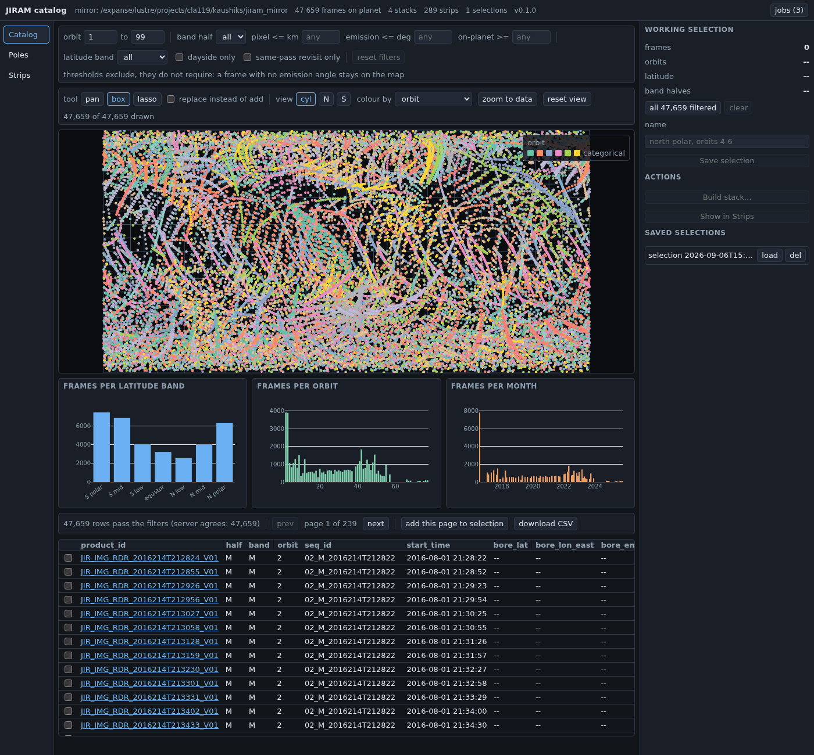

# jiram_catalog

A browser-based catalog and toolkit for the full Juno JIRAM infrared
imager archive (PDS4 bundle `juno_jiram_bundle`, Atmospheres node),
built to feed cloud-tracking and optical-flow style velocity retrieval
at Jupiter. The primary way to use it is the catalog browser below:
every camera frame that sees the planet on one filterable map, a viewer
for the polar time stacks, and a library of per-pass strips with their
statistics -- all served from a cluster node and opened in an ordinary
browser over an SSH tunnel. Everything the GUI shows is a product the
command line underneath it already wrote to disk; nothing is computed
just for the browser.



> **GUI v2 (2026-09-06).** The browser is now a React + deck.gl front
> end served by a FastAPI backend; `jiram-catalog gui` serves it by
> default and `--legacy` serves the earlier Panel version. Colour maps,
> stretch, hover and selection run in the browser; movies play in a
> native player; the selection tray replaces the old "send to" buttons.
> The illustrated guide in `docs/gui_guide.md` still shows the earlier
> version and will be regenerated; the v2 architecture is in
> `docs/gui_v2_notes.md`.

## Start in five minutes

For a collaborator who already has access to the group's shared
cluster copies (the default paths below), there is nothing to build --
clone the repository, sync the environment, and point a browser at a
server you start on a compute node.

```
git clone git@github.com:ksr-ocean/jiram_catalog.git
cd jiram_catalog
uv sync
uv run jiram-catalog config        # confirm which mirror/paper-data paths you'll use
```

`jiram-catalog config` prints the two paths that matter -- the local
**mirror** (`JIRAM_MIRROR`) and the read-only **paper data**
(`JIRAM_PAPER_DATA`) -- and where each came from. Both default to this
group's shared copies on the cluster, so doing nothing reproduces the
existing setup; working from a different mirror or checkout just means
exporting the corresponding environment variable first:

```
export JIRAM_MIRROR=/expanse/lustre/projects/cla119/<you>/jiram_mirror
export JIRAM_PAPER_DATA=/expanse/lustre/projects/cla119/<you>/JIRAM
```

Then, on a compute node (from an interactive allocation -- Expanse
discourages running work on the login nodes):

```
uv run jiram-catalog gui --address 0.0.0.0 --port 5006 --no-browser
```

`--address 0.0.0.0` is needed because the login node has to be able to
reach the server over the cluster network when it forwards your port.
From your laptop, in a second terminal:

```
ssh -N -L 5006:<compute-node>:5006 <user>@login.expanse.sdsc.edu
```

where `<compute-node>` is what `hostname` prints on the allocation.
Open `http://localhost:5006` in your browser. The server has no
authentication, so stop it (Ctrl-C on the node) when you are done. Full
walkthrough of every tab, every control, and what each export writes:
**`docs/gui_guide.md`**.

## Working with an agent

If you are an AI agent (or a human following the same process) about to
change anything in this repository: **read `AGENTS.md` first, then
`docs/agent_harness.md`.** Every change here goes through a spec in
`docs/specs/` and a gate in `tests/test_gate_*.py` before it is written
-- gates, fixtures, and specs are read-only to executors, and passing a
gate by editing it is task failure. This is not a suggestion; it is how
every file in this repository, including this README, was produced.

## What it does

JIRAM's calibrated archive is ~85,000 camera frames, each with archive
label geometry that is missing for the majority of them (absent
entirely for orbits from 2021 onward, and for most dual-band products
at any date -- see `docs/decisions.md`). This tool:

1. **Mirrors** the archive's labels and image data locally, and parses
   every label into one indexed table (`frames.parquet`), with spin
   sequences reconstructed from the archive's own bookkeeping.
2. **Computes geometry from scratch** for every frame with a vectorised
   SPICE engine (per-pixel latitude, longitude, emission, incidence,
   phase; boresight and footprint summaries in `frames_geo.parquet`),
   independent of the label geometry, which becomes only a cross-check.
3. **Reprojects** frames onto named map regions by exact inverse camera
   modelling -- polar caps on the published perijove-4 grid (or any
   pole, any orientation) for repeat-view time series, and per-pass
   tangent-plane patches for the rest of the planet, where JIRAM
   revisits nothing and the natural product is a library of independent
   *strips* rather than a time stack.
4. **Exports** region time stacks as movies and as constant-cadence
   triples in the layout a downstream optical-flow velocity model reads,
   and computes masked spectra, structure functions, and bicoherence for
   the strip library.
5. **Serves the browser-based catalog** above (Panel/Bokeh): Catalog
   (every frame, filterable and selectable), Poles (stack viewer,
   movies, exports), Strips (the strip library, its statistics).

Every claim above is checked against a published result: the geometry
engine, the reprojection, and the map grid it uses were all validated
against the 48 perijove-4 north-polar maps and TRACKER4 wind vectors of
Ingersoll et al. (2022) before anything downstream was built. See
`docs/architecture.md` for how the pieces fit together and
`docs/decisions.md` for what was found and settled along the way
(byte order, band ordering, the map projection, and more).

## What exists today

- Full-archive label mirror and index (85,108 camera frames); image
  data mirrored for a growing subset of orbits (complete and verified
  for orbits 4 and 24; see `docs/open_items.md` for the rest).
- SPICE geometry for every mirrored frame (`frames_geo.parquet`,
  113,565 rows), with three orbits (38, 55, 70) still missing geometry
  because of SPICE kernel coverage gaps -- an open item, not silently
  dropped.
- The region registry (`north_pole_paper`, `north_pole`, `south_pole`,
  `neb_15n`), region time stacks, movies, and velocity-model export.
- The strip library (289 strips across orbits 4 and 24 as of this
  writing) and its statistics.
- The trackability report: which orbits and latitude bands have
  repeat-view geometry that supports velocity retrieval at all, and at
  what wind speed.
- The three-tab GUI, first version (Catalog complete; Poles views
  existing stacks; Strips has the table, map, viewer, and per-strip
  statistics -- population statistics and in-app builds are deferred,
  see `docs/open_items.md`).

## Building a mirror from scratch, from the command line

Everything the GUI shows is written by these subcommands; a
collaborator using the shared mirror does not need to run them, but
building your own (or extending the shared one to more orbits) starts
here:

```
uv run jiram-catalog manifest --orbits 4
uv run jiram-catalog mirror --orbits 4 --kinds labels,data --jobs 3 --verify
uv run jiram-catalog index --orbits 4
uv run jiram-catalog kernels --orbits 4
uv run jiram-catalog geo --orbits 4
uv run jiram-catalog regions
uv run jiram-catalog region-stack --region north_pole_paper --orbits 4 --band M --level sequence
```

`uv run jiram-catalog --help` lists every subcommand; `docs/usage.md`
has the full reference and more worked examples (a movie, a
velocity-model export, strips, statistics, the GUI). Path resolution
(mirror and paper-data precedence, the optional TOML config file) is in
`docs/configuration.md`.

## What is in the box

- `docs/README.md` -- index of every document in this repository.
- `docs/architecture.md` -- the system as built, module by module.
- `docs/usage.md` -- the command reference and worked examples.
- `docs/gui_guide.md` -- the catalog browser, tab by tab, with real
  screenshots.
- `PEDAGOGICAL_REVIEW.md` -- a teaching-oriented walk through how this
  codebase was built and reviewed.
- `docs/decisions.md` -- one entry per settled choice, with evidence.
- `docs/open_items.md` -- known gaps, honestly listed.
- `AGENTS.md` -- start here before changing any code; this repository
  is built by a spec -> gate -> execute -> verify loop
  (`docs/agent_harness.md`), and gates, fixtures, and specs are
  read-only to executors.
