# The catalog browser: a guide

This is a walkthrough of `jiram-catalog gui`, the browser-based catalog
of this repository's products. The server started by this command is
now GUI v2: a small FastAPI backend that answers Arrow, JSON and PNG
under `/api`, and a React + deck.gl single-page front end that holds
all of the state and does all of the drawing in the browser. Every
screenshot below is a real capture of the running app (headless
Chromium via Playwright), not a mockup; `docs/gui_guide/take_screenshots.py`
reproduces every one of them. If you just want to get the server
running and a browser pointed at it, skip to
["Serving and tunnelling"](#serving-and-tunnelling) -- the rest of this
page assumes it is already open in front of you.

The GUI does not compute anything new: it is a view and a selector over
files the command line already wrote (`docs/usage.md`). Nothing you do
in the browser touches the published archive mirror except the app's
own cache, `<mirror>/gui_cache/`, and the region stacks you explicitly
ask it to build under `<mirror>/regions/`.

## About these screenshots

Two things worth knowing before reading them literally. First, the
Catalog tab's map sits above the coverage charts and the table in one
scrolling column, and at a short browser window the map can be squeezed
down to a thin strip well under its intended size before the charts and
table give it room back -- a real, reproducible layout behaviour, not a
headless-only artifact (confirmed by resizing the same page at several
heights). The screenshots below were taken from a tall enough window
that this does not happen; if your own window shows a sliver instead of
a map, make it taller.

Second, hovering a point on the Catalog map is answered by GPU picking
through deck.gl when it can, and by a roughly fourteen-pixel
nearest-point search over the same data when it cannot; this cluster
node has no GPU, so every screenshot here runs on Chromium's SwiftShader
software implementation of WebGL 2, which deck.gl accepts and which
does perform GPU picking correctly (`docs/gui_v2_notes.md`). Every
interaction shown below -- filtering, the polar toggle, hovering,
box-selecting, saving a selection to the tray, stepping the time slider,
changing the colour map, and opening a strip's statistics -- was driven
headlessly by the screenshot script exactly as captured, and the same
interactions are asserted on by the automated end-to-end suite
(`frontend/e2e/*.spec.ts`) against a live backend. None of it had to be
described in words instead of shown.

## The layout

A top bar names the app, shows the mirror path and its counts (frames
on the planet, stacks, strips, saved selections, the app version) from
`/api/config`, and carries a **jobs** button that opens the list of
every background job started in this session (kind, status, progress,
message; queued jobs can be cancelled), polled every two seconds. Below
it, a column of three view tabs on the left -- **Catalog**, **Poles**,
**Strips** -- and, on the right, the **selection tray**, which is always
visible no matter which tab is active. The middle is the active view.
All three views stay mounted underneath even when their tab is not
showing, so switching tabs never throws away a loaded stack or strip.


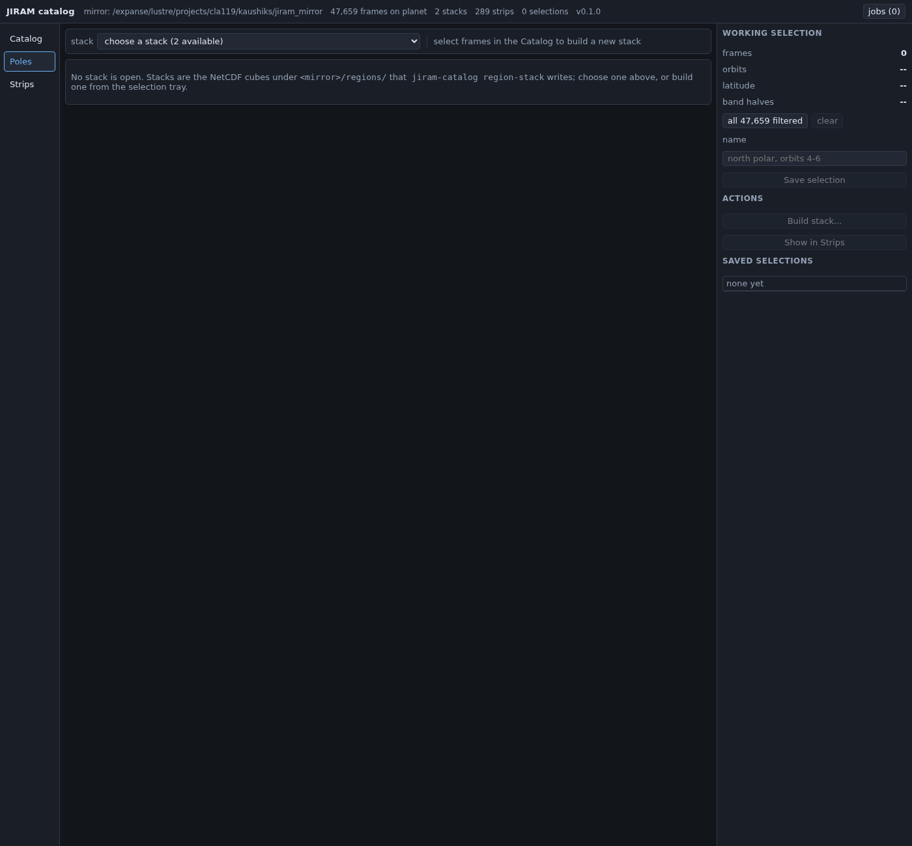

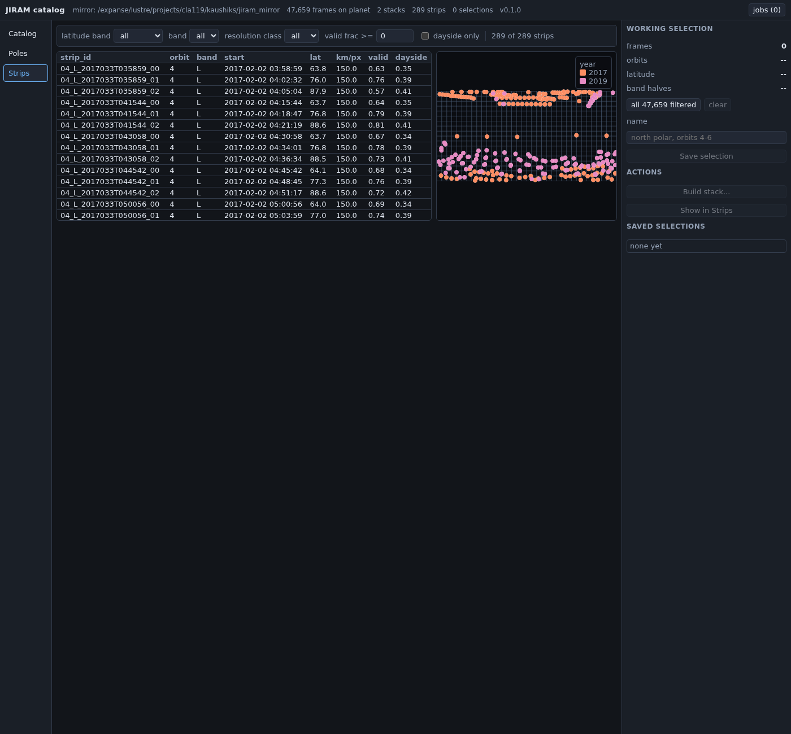

Neither Poles nor Strips auto-selects anything when the page loads --
that is a deliberate difference from the previous version, where the
Strips tab always opened on some strip whether you wanted one or not.
Here both tabs start empty and wait for you to choose.

## The selection tray

This is the one part of the window every other view writes into, and it
replaces the earlier "send to Poles" / "send to Strips" buttons, whose
effect used to be invisible. The tray is a permanent column showing
exactly what is selected, where it can be saved, and the two things you
can do with a selection once you have one.

**What can add to it.** A box or lasso drag on the Catalog map, a row's
checkbox in the Catalog table, "add this page to selection" in the
Catalog table's toolbar, "add to selection" on a frame's detail card,
or "all `N` filtered" in the tray itself, which replaces the working
selection with every row currently passing the Catalog's filters
regardless of which tab you are looking at.

**Tray controls**, one sentence each:

| control | does |
| --- | --- |
| frames / orbits / latitude / band halves | a live summary of the working selection: frame count, the orbit numbers as compressed ranges (e.g. `4-11, 14, 16-17`), the min-to-max boresight latitude span, and which detector halves are present |
| all `N` filtered | replaces the working selection with every row the Catalog's current filters pass |
| clear | empties the working selection |
| name | a text field for the selection's name, used when you save it |
| Save selection | posts the working selection to `/api/selections` under this name (disabled until something is selected) |
| Build stack... | opens a dialog to build a new region stack from the selection (disabled until something is selected) |
| Show in Strips | filters the Strips tab to strips whose orbit is one of the selection's orbits, and switches to that tab (disabled until something is selected) |
| saved selections list | every selection saved on this mirror (by anyone), each with **load** (replaces the working selection with the saved one) and **del** (deletes it) |

The **Build stack...** dialog asks for a region (the four names in
`configs/regions.yaml` plus any region that already has a stack), band
(`M` or `L`), level (`sequence` or `frame`), and a maximum emission
angle (default 80 deg). Submitting it saves the selection first, then
posts `/api/stacks/build` with that selection's id, so the job is
restricted to exactly those frames; the new file lands under
`<mirror>/regions/<region>/` and the stack list on the Poles tab
refreshes when the job finishes.

The working selection and its name persist in your browser's
`localStorage` across a reload; a **saved** selection is a small JSON
file under `<mirror>/gui_cache/selections/<id>.json` that anyone
pointed at this mirror can load by name -- the two are not the same
thing, and only the second survives switching browsers or machines.

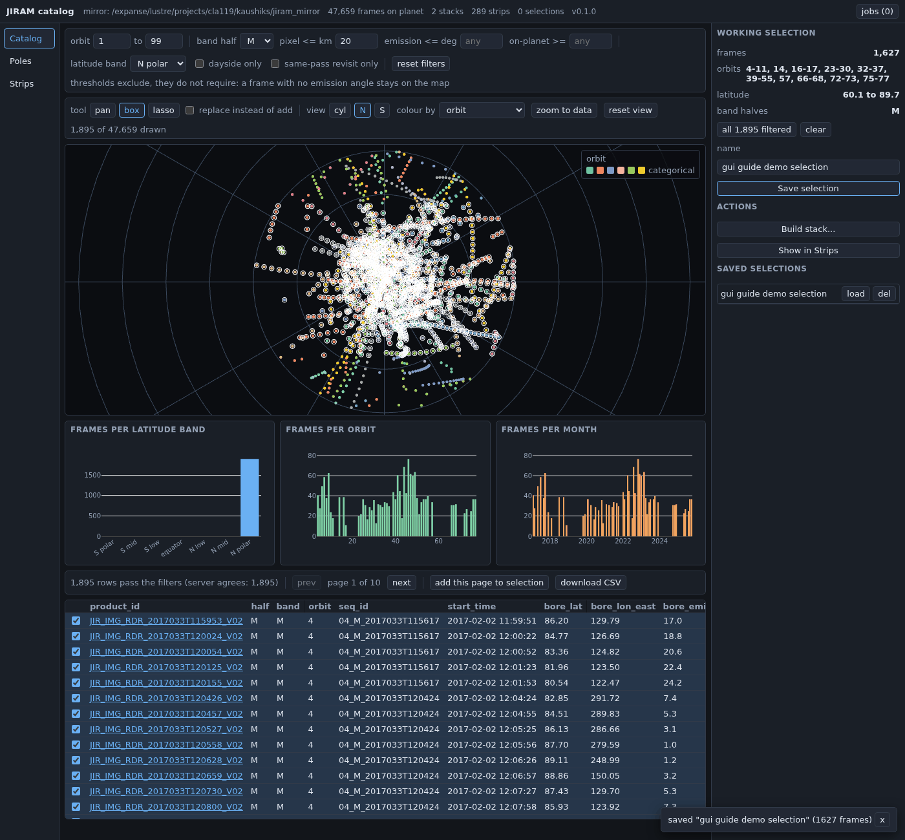

## Catalog

**What it shows.** Every camera frame that sees the planet -- about
47,600 of the archive's 113,000 (frame, band-half) rows, the rest
excluded because `on_planet_frac` is zero or the geometry engine could
not fix the frame at all -- as boresight points on a map, drawn as GPU
point primitives rather than rasterised, which is what makes hovering
and picking work at full point count. Below the map, three coverage
charts (frames per latitude band, per orbit, per month) come from
`/api/catalog/summary` computed by the server with the same filter
parameters the map applies on the client, so the two cannot disagree
about what "the current set" is -- the table's caption prints both
counts side by side for exactly this reason. Below that, a paginated
table of the filtered rows with checkboxes into the selection tray.

**Filter toolbar**, one sentence each:

| control | does |
| --- | --- |
| orbit | inclusive numeric range of orbit directories to include (default 1 to 99, effectively all) |
| band half | `all`, `L`, or `M` -- which detector half's frames to keep |
| pixel <= km | drop frames whose median pixel size exceeds this (blank = no limit) |
| emission <= deg | drop frames whose boresight emission angle exceeds this (blank = no limit) |
| on-planet >= | drop frames whose on-planet pixel fraction is below this (blank = no limit) |
| latitude band | one of the seven trackability-table bands, or `all` |
| dayside only | keep only frames with a nonzero dayside fraction |
| same-pass revisit only | keep only frames with a same-pass revisit partner (hidden entirely when `has_trackability` is false, i.e. `index/trackability_frames.parquet` does not exist) |
| reset filters | puts every filter above back to its default (disabled once they already are) |

Every threshold above *excludes*, it does not *require*: a frame whose
emission angle the geometry engine could not resolve stays on the map
instead of vanishing the moment a slider moves. The two exceptions are
on-planet fraction and the latitude band, which drop a row outright when
its value is missing -- a frame whose boresight misses the planet has no
latitude to be inside a band (the toolbar says as much beneath the
filters).

**Map toolbar and map**, one sentence each:

| control | does |
| --- | --- |
| tool: pan / box / lasso | pan drags the view and scrolls to zoom; box and lasso drag a rectangle or a free-form outline that adds the enclosed points to the selection on release |
| replace instead of add | when checked, a box or lasso selection replaces the working selection instead of adding to it |
| view: cyl / N / S | longitude-latitude, or azimuthal-equidistant polar centred on the north or south pole (`rho = 90 - abs(lat)`) |
| colour by | orbit, year, pixel size (km), or emission (deg) -- the first two are categorical, the last two a viridis ramp, with a legend in the corner |
| zoom to data | fits the view to the extent of whatever currently passes the filters |
| reset view | fits the view to the fixed limits of the current projection (the whole globe in `cyl`, the whole cap in `N`/`S`) |
| the map | hover for a tooltip (product id, time, orbit, sequence, pixel size, emission); click a point to open its frame detail card |

**Table toolbar and table:**

| control | does |
| --- | --- |
| caption | `N rows pass the filters (server agrees: M)` -- the client and server counts for the same filters |
| prev / next, page label | 200 rows a page |
| add this page to selection | adds the 200 rows currently shown to the working selection |
| download CSV | downloads every filtered row (not just the current page, and independent of what is selected) as `jiram_catalog_filtered.csv`, a browser download |
| row checkbox | adds or removes that one row from the working selection |
| product id link | opens the frame's detail card: every column of `frames_with_geo` for that product, plus an "add to selection" button for whichever detector halves it has |

**Typical workflow.**
1. Narrow the filter toolbar until the coverage charts show the subset
   you care about.
2. Optionally switch to a polar view for a pole-centred look.
3. Box- or lasso-select on the map, check rows in the table, or use
   "all `N` filtered" in the tray -- or do nothing and work with the
   filtered set as it is.
4. Read the table, or download it as CSV.
5. Save the selection by name in the tray, and use it to build a stack
   or jump to the matching strips.

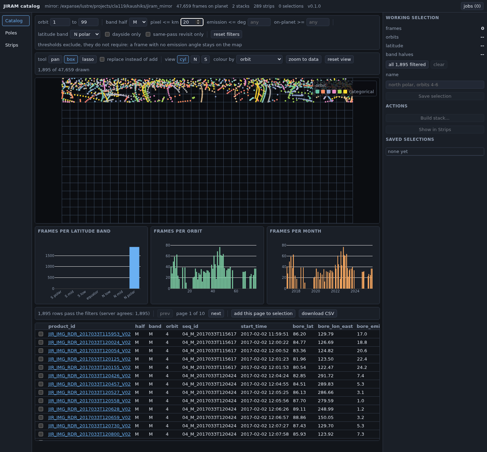

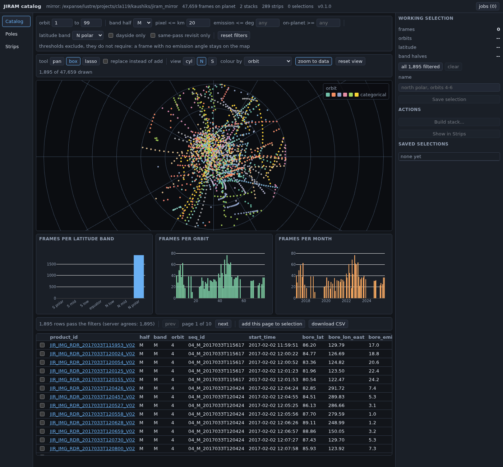

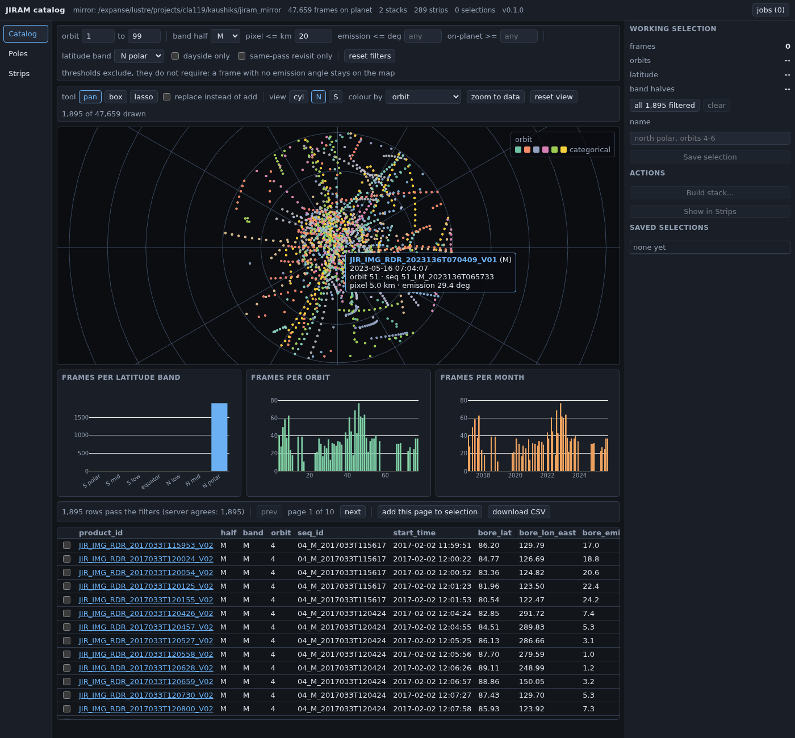

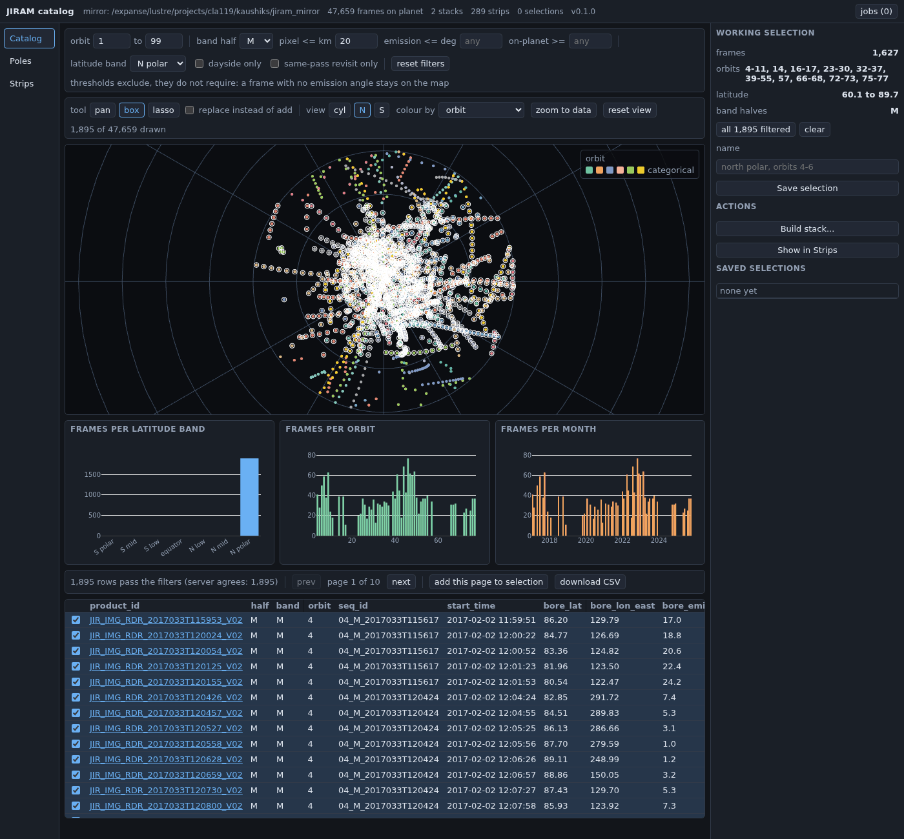

**What the exports produce and where they land.** "download CSV" is a
browser download; it goes wherever your browser puts downloads, not
onto the mirror. "Save selection" writes
`<mirror>/gui_cache/selections/<id>.json`, shared with anyone using this
mirror. "Build stack..." writes a new NetCDF under
`<mirror>/regions/<region>/`.

**What to do when the map looks empty.** The table caption reads `0
rows pass the filters` when every row has been excluded. The two
easiest filters to over-tighten are pixel size and on-planet fraction;
the fastest fix is usually "reset filters" or loosening whichever
slider you touched last. If the map looks like a thin coloured sliver
rather than empty, that is the short-window layout behaviour described
above, not an empty result -- check the "N of M drawn" count next to the
map toolbar before assuming nothing survived the filters.

## Poles

**What it shows.** A viewer for the region time stacks
`jiram-catalog region-stack` already wrote under `<mirror>/regions/`,
plus the means to build a new one from a tray selection. A stack is
never loaded whole: it is opened lazily server-side and one time step
is read when the player moves; the display stretch and the graticule
are computed once per stack and cached under
`<mirror>/gui_cache/meta_<key>.json`, keyed to the file's own size and
modification time. Nothing here is auto-selected at first load.

**Toolbar and hints:**

| control | does |
| --- | --- |
| stack | choose a stack from `<mirror>/regions/*/*.nc`, listed as `<id> - <band> <level>, <n> steps`, with `[movie]` when one has been rendered |
| the summary line | shape, km/px, and file size of the chosen stack, from the listing |
| the hint line | reminds you that frames selected in the Catalog can become a new stack via the tray's "Build stack..." |

**Viewer controls**, once a stack is open:

| control | does |
| --- | --- |
| play / pause, < / > | step through time; playback speed is the `speed` field, keyboard left/right also step it while this tab is focused |
| time | the slider and its `t/N` label |
| speed | frames per second while playing (1-30) |
| colour map | `gray`, `viridis`, `magma`, `inferno`, or `cividis` -- a 256-entry lookup table applied to pixels already in the browser, so changing it never needs a new request from the server |
| graticule | overlays parallels every 2 deg and meridians every 30 deg, from the stack's own coordinate arrays (on by default) |
| emission overlay | a 0-1 opacity slider blending in the per-pixel emission-angle PNG (always drawn with an inferno ramp), fetched only once you raise this above zero |
| vmin / vmax | the display stretch's numeric limits; editing either refetches the frame at the new stretch, debounced by 350 ms so you can type without a flood of requests |
| reset stretch | puts vmin/vmax back to the stack's own 1st/99th percentile |
| the image itself | drag to pan, scroll to zoom (aspect ratio locked by construction, so it cannot distort); hovering shows an x/y (km) readout |
| frame metadata | time, product id, sequence id, orbit, frame count, emission, km/px, and the served x/y range for the current step, from the stack's own per-time coordinates |

**Movie panel:**

| control | does |
| --- | --- |
| the player | a native `<video controls>` element over `/api/stacks/{id}/movie`, present only when the stack has a rendered movie |
| Render movie | starts a background job (current speed as fps, 1st/99th percentile stretch, current colour map); reloads the video element when the job finishes |
| Export triples | starts a background job that writes a constant-cadence velocity-model dataset; a toast reports where it landed and how many realizations |

The next two frames are prefetched into a twenty-entry cache while
playing, so playback should not stutter once it gets going.

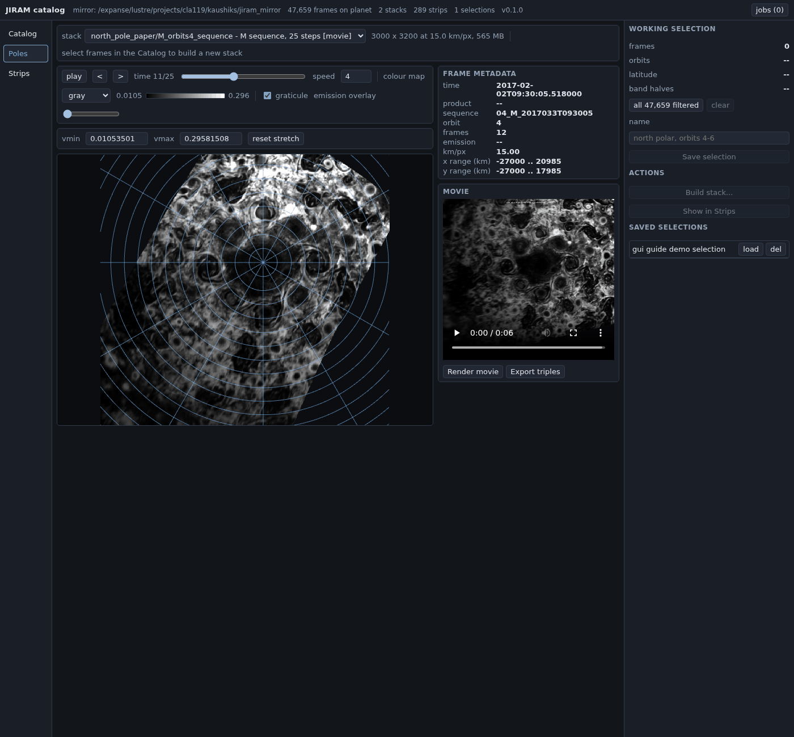

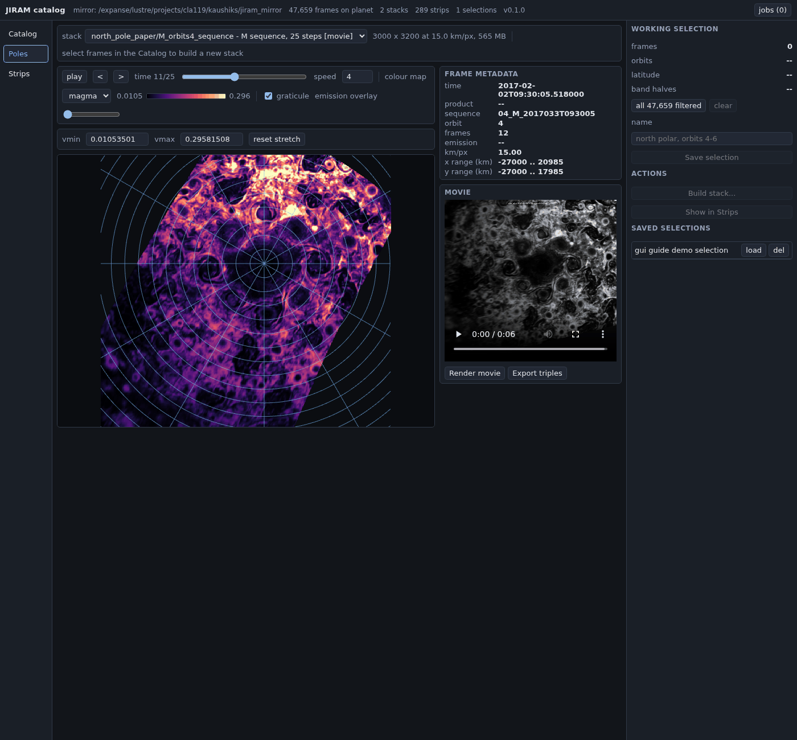

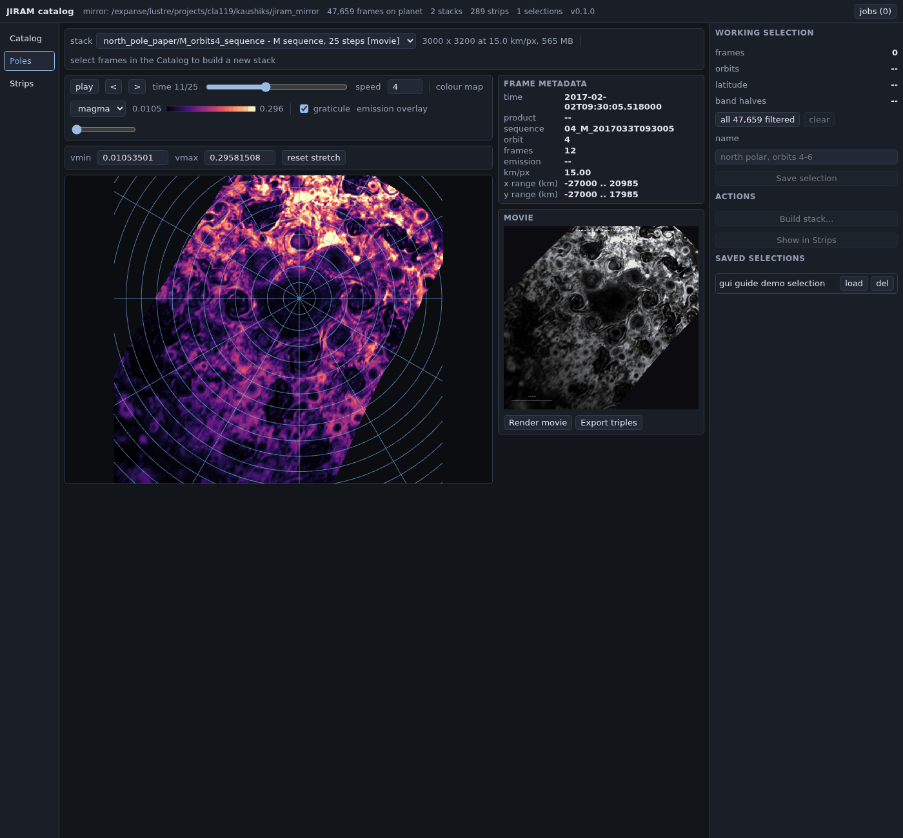

**What the exports produce and where they land.** A rendered movie is
written next to its stack, `<mirror>/regions/<region>/<stem>.mp4`.
"Export triples" writes under `<mirror>/gui_cache/exports/goflow_<id>/`
by default. "Build stack..." (in the selection tray) writes
`<mirror>/regions/<region>/<BAND>_orbits<token>_<level>.nc`, where
`<token>` is the orbit list the job ran on, or `all` when it was built
from a tray selection rather than an explicit orbit range.

**What to do when a stack is slow to open.** A frame-level stack (every
contributing frame kept, not composited per sequence) can be 2 GB; a
sequence-level composite of the same orbit is a fraction of that. The
first time a given stack file is opened, the server computes its
display stretch and graticule and writes them to
`<mirror>/gui_cache/meta_<key>.json`; every later open of the same file
(even after restarting the server) reads that cache instead of
recomputing, so a stack that stays slow past its first open on this
mirror is more likely a busy shared filesystem than the app itself.
Stepping through time should stay fast throughout, since each frame is
downsampled server-side before it is sent.

## Strips

**What it shows.** The per-pass strip library: a filterable table, a
small map of strip centres coloured by year, a viewer for whichever
strip you open, and that strip's statistics. Unlike Poles, Strips has no
time axis -- each strip is one independent look, reprojected onto its
own tangent-plane grid (`docs/architecture.md`, "The two regimes, side
by side"). Nothing is opened automatically; the table and centres map
are there from the first load, and clicking a row or a point opens a
strip.

**Filter toolbar:**

| control | does |
| --- | --- |
| latitude band | one of the seven trackability-table bands, or `all`; a strip is kept when its own latitude span overlaps the band, not just its centre |
| band | `all`, `L`, or `M` |
| resolution class | whichever resolution-class labels are present in this library's strips, or `all` |
| valid frac >= | threshold on the strip's own valid-pixel fraction (default 0, i.e. no filter) |
| dayside only | keep only strips with a nonzero dayside fraction |
| strip count | `N of M strips` |
| the tray's orbit note | shown only after "Show in Strips" in the tray; names the orbits it limited the table to, with a **clear** button |

**Viewer and statistics**, once a strip is open:

| control | does |
| --- | --- |
| library table row / a point on the centres map | click either to open that strip |
| current strip | the open strip's id |
| colour map | `gray`, `viridis`, `magma`, `inferno`, or `cividis`, same LUT mechanism as Poles |
| graticule | parallels every 2 deg, meridians every 30 deg |
| local-time contours | dashed contours every 2 h from the strip's own local-time field |
| the image itself | drag to pan, scroll to zoom, hover for an x/y (km) readout |
| Download stats (JSON) | downloads the current strip's statistics payload as `<strip_id>_stats.json`, a browser download (disabled until the statistics have loaded) |
| isotropic spectrum | `E(k)` on log-log axes, annotated with the wavelength range it spans |
| 1-D spectra (x, y) | the along-track and cross-track power spectra |
| structure functions | `S2` (log-log) and the signed `S3` (linear, secondary axis) |

**Typical workflow.**
1. Filter the library table down to the strips you want, or arrive here
   from the tray's "Show in Strips".
2. Click a row or a point on the centres map to open a strip.
3. Read the image and its statistics; download the stats JSON if you
   need them outside the browser.

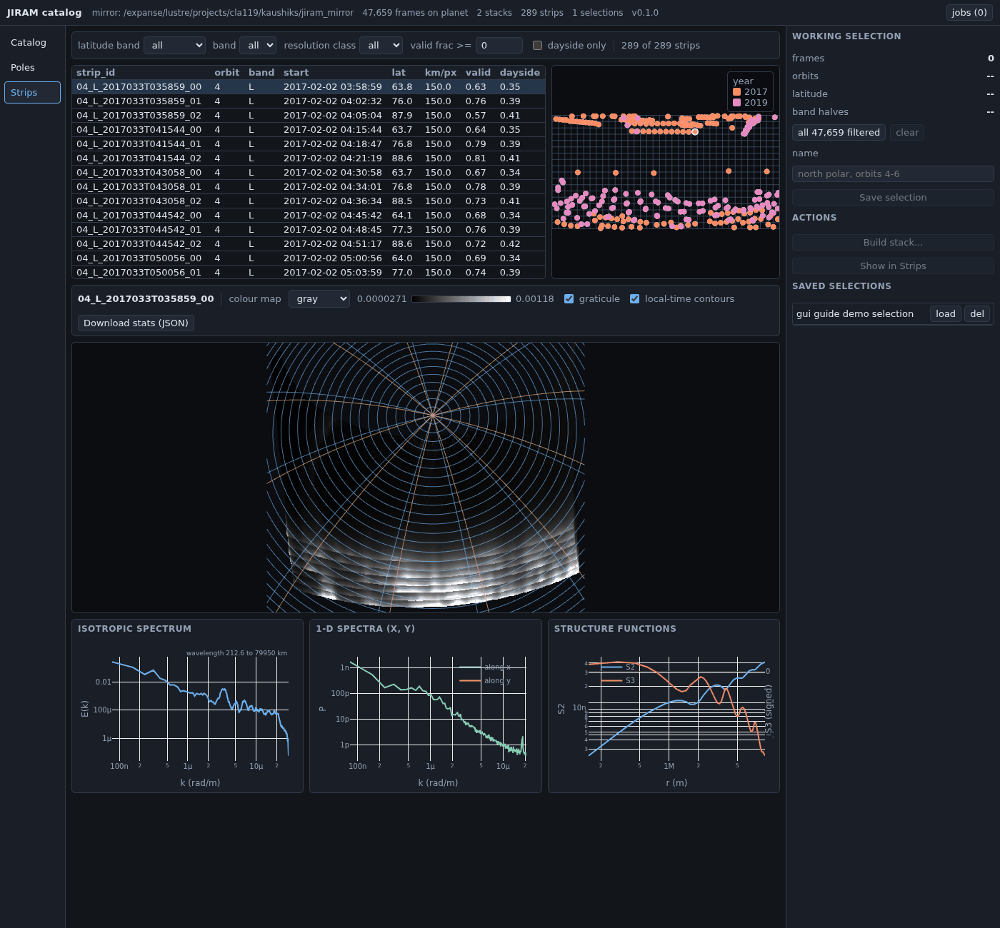

**What the exports produce and where they land.** "Download stats
(JSON)" is a browser download. There is no bulk CSV export of the
filtered library on this tab (the Catalog tab's CSV export is the one
that writes a file); the library table itself is the way to read many
strips' metadata at once.

**What to do when a strip has no statistics yet.** `/api/strips/{id}/stats`
checks an on-disk cache first (`<mirror>/gui_cache/stats_<strip_id>.nc`,
the same file `stats2d.strip_statistics` writes); if a strip has never
been opened before, the server computes it on that request, which takes
a few seconds. The three plot panels are simply absent until the
request returns -- like every other network call here, it runs through
the loading/error machinery rather than freezing the page, so the rest
of the tab stays usable while you wait. Every later visit to that strip,
including after a server restart, is instant.

## The two regimes, and how the tabs map to them

This tool treats the polar caps and everywhere else as genuinely
different products (`docs/architecture.md`):

| | polar / repeat-view (regime 1) | everywhere else (regime 2) |
| --- | --- | --- |
| product | region time stack | strip library |
| grid | fixed per region, shared across frames | one per chunk, centred on that chunk |
| time axis | real (multiple visits) | none (one look) |
| GUI tab | **Poles** | **Strips** |
| designed for | velocity retrieval at a cadence | distribution-level statistics across many independent looks |
| ground truth | Ingersoll et al. (2022) PJ4 maps and TRACKER4 vectors | none published; internal consistency only |

**Catalog** sits above both regimes, as the one place that shows every
frame regardless of which regime (if either) it ends up feeding, and
the **selection tray** is the route from a Catalog selection into
whichever regime you are working in: "Build stack..." feeds regime 1,
"Show in Strips" feeds regime 2.

## Serving and tunnelling

Exact commands, copied from `docs/gui_usage.md` (see that file for the
full explanation of each flag; the same command now serves GUI v2 by
default -- `--legacy` would serve the earlier Panel version instead,
and nothing here uses it).

Run the server on a compute node from an interactive allocation
(Expanse discourages running work on the login nodes; an interactive
node with tens of cores and 128 GB is the normal home for this tool).
On the node:

```
cd <repository>
uv run jiram-catalog gui --port 5006 --address 0.0.0.0 --no-browser
```

`--address 0.0.0.0` is needed on a compute node because the login node
must be able to reach the server over the cluster network when it
forwards your port; the default loopback binding only works when the
browser tunnel terminates on the same machine. Then, from your laptop,
in a second terminal:

```
ssh -N -L 5006:<compute-node>:5006 <user>@login.expanse.sdsc.edu
```

where `<compute-node>` is the name printed by `hostname` on the
allocation (for example `exp-2-45`). Open `http://localhost:5006` in
your browser. The server has no authentication, so while it runs any
process on the cluster network can open it; stop it when you are done
(Ctrl-C on the node). The web socket origin check is disabled by
default so the tunnelled `localhost:5006` address is accepted.

## FAQ

**Why does the Catalog map sometimes look like a thin strip instead of
filling its box?** The map sits above the coverage charts and the table
in one column, and at a short browser window that column runs out of
room and squeezes the map down before it touches the charts or table --
confirmed by resizing the same page at several heights, not a headless
quirk. Maximizing the browser window, or using a portrait-oriented
screen, gives it back its full height; the "N of M drawn" count next to
the map toolbar tells you the real point count regardless of how big
the map is drawn.

**Where does anything I export actually go?** Saved selections under
`<mirror>/gui_cache/selections/`; a built stack under
`<mirror>/regions/<region>/`; a rendered movie next to its stack; a
goflow export under `<mirror>/gui_cache/exports/` by default; strip
statistics cached at `<mirror>/gui_cache/stats_<strip_id>.nc`; stack
metadata cached at `<mirror>/gui_cache/meta_<key>.json`. CSV and JSON
downloads are browser downloads, not files on the mirror. Nothing else
under the mirror is touched, and no request leaves the node.

**Does it remember my filters and selection?** The Catalog's filters
and the working selection persist in your browser's own `localStorage`,
so a reload of the page lands you back where you were -- but only in
that browser, on that machine; a private window or a browser with site
data disabled will not remember anything, and it degrades quietly
rather than erroring. A **saved** selection (the tray's "Save
selection" button) is different: it is a small named file on the
mirror itself, visible to anyone pointed at the same mirror, and is the
way to hand a selection to a collaborator or to yourself on another
machine.

**What changed from the previous version?** State and rendering now
live in the browser rather than the server: colour map changes are an
instant redraw (no request that can silently fail to arrive), hovering
works at full point count because the points are on the client, a
rendered movie plays in a native video element, and zooming cannot
distort the aspect ratio. The selection tray replaces the earlier
"send to Poles" / "send to Strips" buttons with a permanent, visible
object. Two things the earlier version had are gone: an explicit
"save session" file and a single-frame PNG export from the Poles tab;
saved selections and the stats JSON download cover the corresponding
uses that carried over.

**Which interactions could this guide not verify visually?** None, this
time -- every screenshot above, including the box-select, the polar
toggle, the hover tooltip, saving a selection, stepping the time slider
and changing the colour map, opening a strip, and reading its
statistics, was driven headlessly by
`docs/gui_guide/take_screenshots.py` and is also exercised by the
automated end-to-end suite. The one caveat in this guide is the
short-window map-squeeze behaviour described above, which is a real
layout behaviour of the app rather than something the guide could not
capture.
