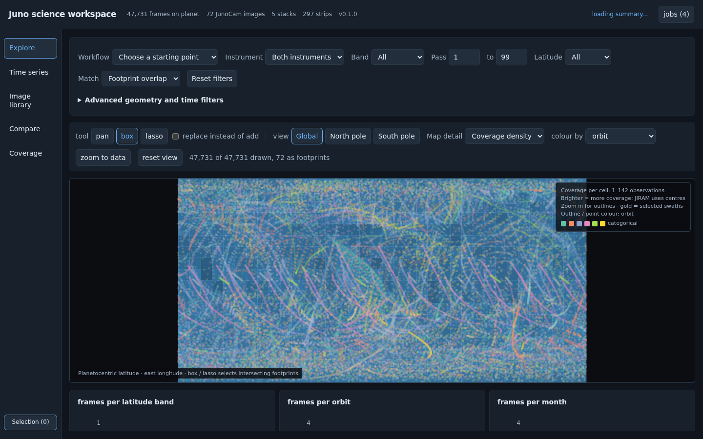
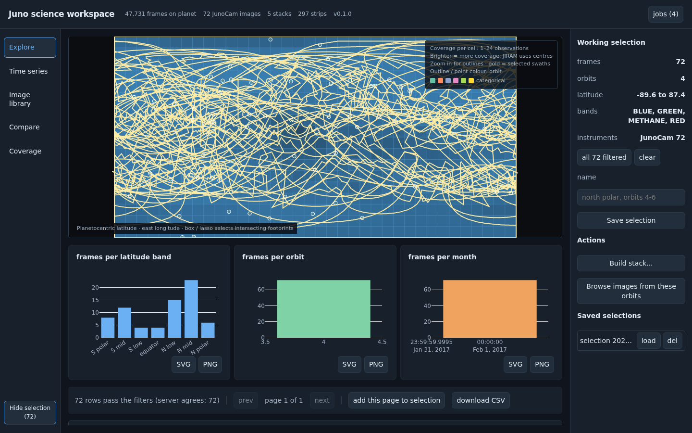
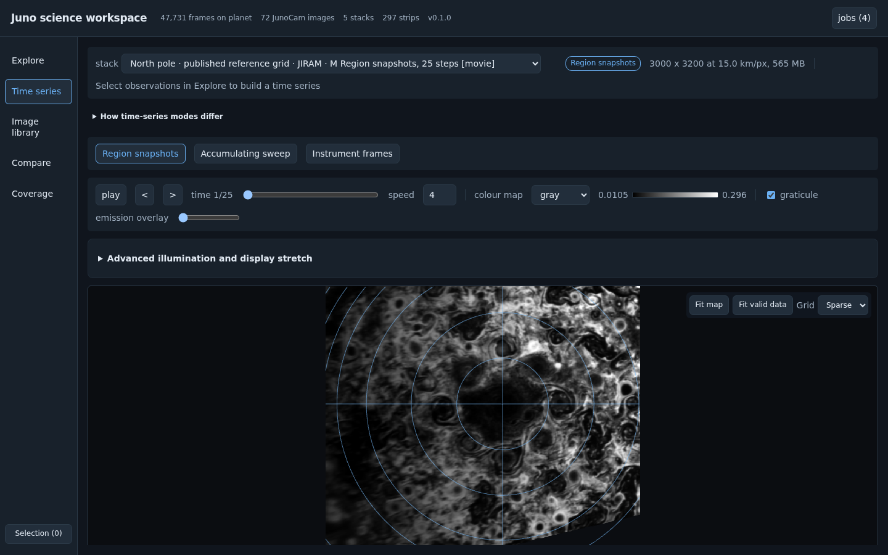
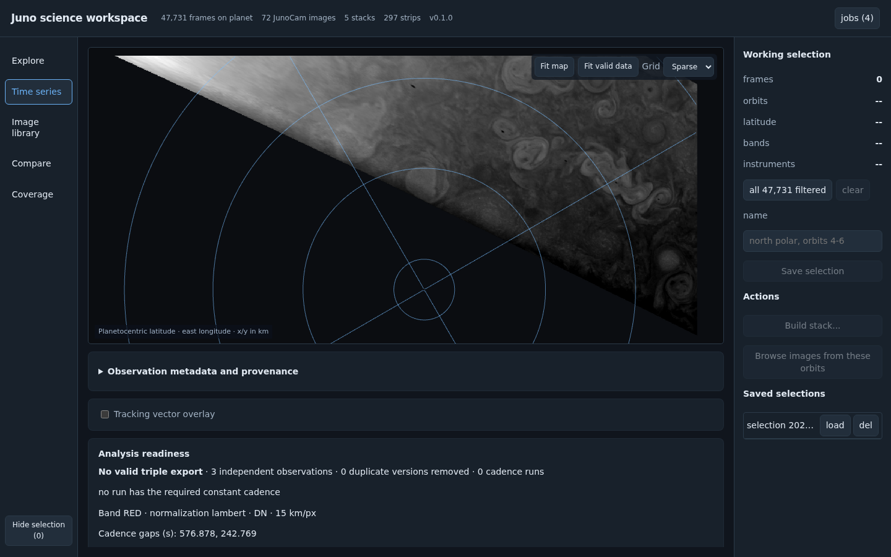
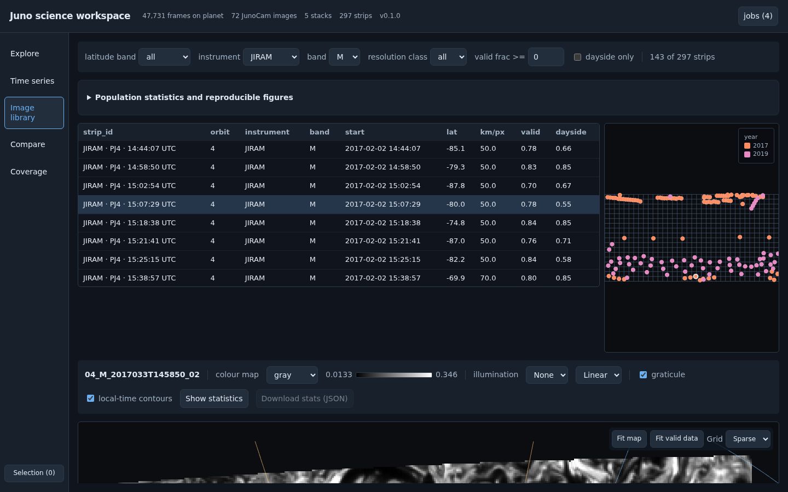
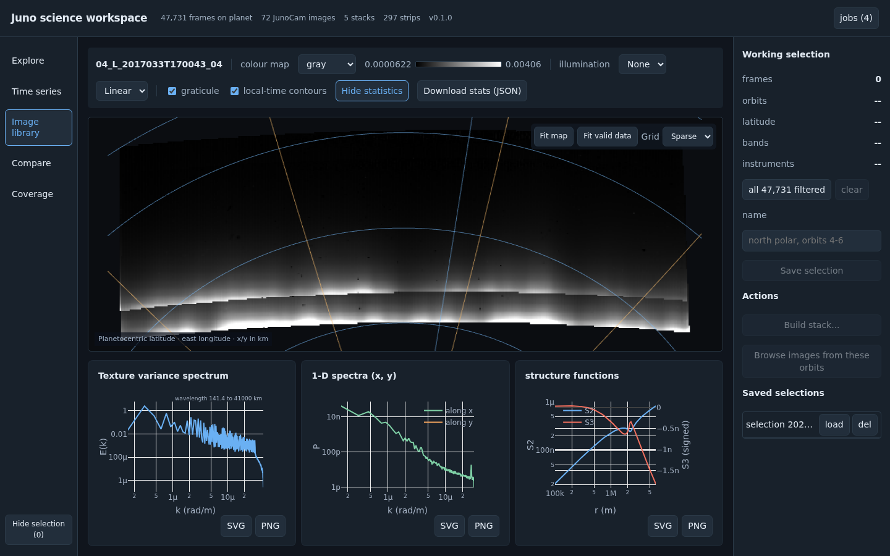
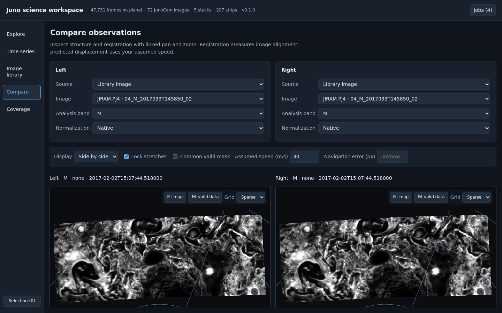
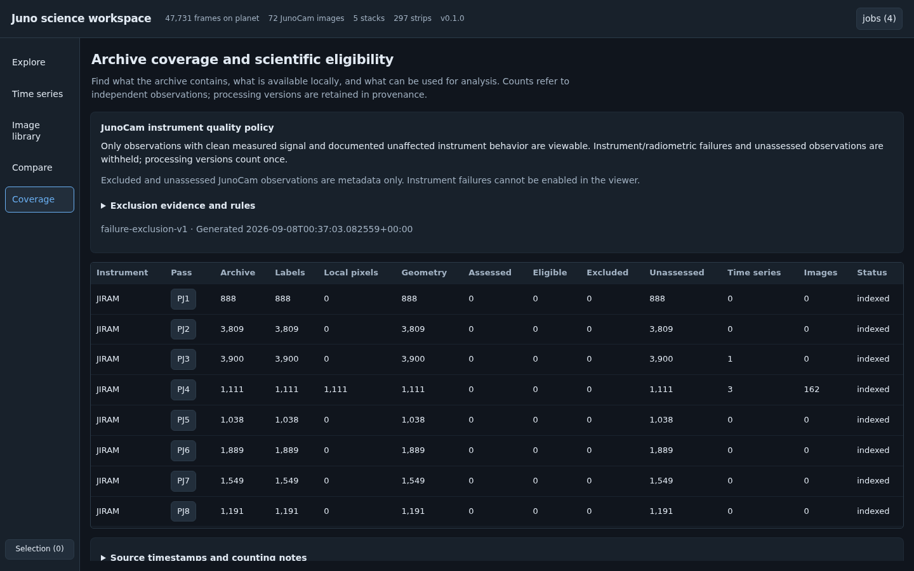

# The Juno science workspace: an illustrated guide

Updated **2026-09-08** for the five-view interface and bounded JunoCam
expansion. Screenshots retain their **2026-09-07** capture date and show the
same controls. Counts and available products are dated snapshots of the local
mirror; your session may contain more observations or different region builds.

Use this guide for the practical steps. The [scientific workflow and capability
matrix](research_workflow.md) explains interpretation and validation limits;
[GUI usage](gui_usage.md) is the short serving reference.

## A first session

1. Open **Explore**. Choose **Repeat cloud views** under **Workflow** for
   JIRAM M-band revisit candidates, or select **JunoCam** under **Instrument**
   to inspect eligible visible-light observations.
2. Set the pass and latitude range. Keep **Match → Footprint overlap** when
   you want observations covering a region, including swaths centred outside it.
3. Open an observation from the table to inspect its identity, source links
   and quality evidence. Add useful observations to the selection.
4. Open **Image library** for existing mapped images, or **Time series** for
   an existing region stack. Use **Fit valid data** if a swath occupies only
   a small part of its map.
5. For quantitative work, choose a physical band and inspect its units,
   normalization and mask. Use **Compare** to examine registration, or request
   statistics in **Image library**. Download the numbers and recipe with a figure.

You can browse existing products without building a stack. A selected catalog
observation, a mapped library image and a usable time sequence are different
stages; **Coverage** shows which stages exist.

## Start the server and connect

On an allocated compute node, from this repository:

```bash
uv run jiram-catalog gui --port 5006 --address 0.0.0.0 --no-browser
```

From a separate terminal on your laptop:

```bash
ssh -N -L 5006:<compute-node>:5006 <user>@login.expanse.sdsc.edu
```

Replace `<compute-node>` with the allocation's `hostname` and `<user>` with
your cluster username, then open `http://localhost:5006`. The address option
lets the login node reach the compute node. The mirror comes from
`JIRAM_MIRROR` or the configured default; see [configuration](configuration.md).

Keep both terminals running. Stop the server and tunnel with Ctrl-C when
finished. The server has no authentication and is reachable from the cluster
network while bound this way.

## Find your way around

The left navigation contains five views. **Selection (n)** opens the tray;
**Hide selection** gives the image more width without discarding its contents.
The top bar reports local product counts and provides the jobs indicator.
Expandable metadata and advanced controls leave room for images at ordinary
desktop sizes; scroll the main view to reach analysis and export panels.

| View | Use it for | Main result |
|---|---|---|
| [**Explore**](#explore-find-and-select-observations) | Search mapped observations by instrument, pass, time and geometry | Observation details, selections, filtered catalog CSV |
| [**Time series**](#time-series-inspect-repeated-views-and-export-a-sequence) | Inspect successive looks at a named region | Readiness report, movie, velocity-model input export |
| [**Image library**](#image-library-inspect-texture-and-build-a-scientific-figure) | Inspect mapped strips and compare texture statistics | Individual statistics, population figures and recipes |
| [**Compare**](#compare-examine-alignment-and-change) | Examine two strips or region frames together | Shared-mask view, registration diagnostics and comparison recipe |
| [**Coverage**](#coverage-understand-availability-and-junocam-exclusions) | Understand archive availability, processing and exclusions | Metadata search, policy evidence, reference links and coverage JSON |

## Explore: find and select observations



The map starts with **Coverage density**, which makes broad sampling patterns
visible without filling the display with overlapping outlines. The table and
summary charts below it reflect the catalog filters. Density represents
observation coverage, not measured brightness or a quality score.

### Search controls

| Control | What it does |
|---|---|
| **Workflow** | Applies a starting preset and resets the other search filters. Repeat cloud views selects JIRAM M revisits; Polar morphology starts northward of 60°; Single-pass texture applies emission/on-planet limits; Cross-instrument context includes both instruments. |
| **Instrument / Band** | Restricts observation identity and available physical channels. JunoCam controls do not offer JIRAM detector halves or a JIRAM revisit test. |
| **Pass … to** | Selects an inclusive perijove range. |
| **Latitude / Match** | Matches footprint latitude coverage by default, or the boresight centre when requested. Latitude is planetocentric. |
| **Advanced geometry and time filters** | Adds resolution, emission, on-planet fraction, UTC dates, dayside and applicable JIRAM half/revisit limits. Missing resolution or emission values remain included; inspect their metadata. |
| **Reset filters** | Restores the default catalog search. It does not clear the selection. |
| **Global / North pole / South pole** | Changes the map projection, independently of which observations pass the filters. Longitude is east-positive. |
| **Map detail / colour by** | Chooses density or all outlines, and colouring by orbit, year, pixel size, emission or instrument. Use outlines on a narrowed search to inspect individual swaths. |
| **zoom to data / reset view** | Fits filtered observations or restores the map's general extent. |

A latitude footprint match uses the available footprint latitude extent,
falling back to the boresight when that extent is missing. It is a search
criterion, not an exact valid-pixel overlap calculation. **Dayside only**
selects observations with a dayside contribution; it does not certify that
all their pixels are illuminated. Thermal JIRAM emission can be useful on
the nightside.

Hover or click observations on the map, or open a row in the catalog table.
The detail card shows the product ID, processing version, source/label links,
quality reasons and available preview. Expand **Processing and provenance**
or **All catalog metadata** for more detail. An older eligible processing
version can be inspected explicitly when versions are available.

**Find cross-instrument context** looks for candidate observations within
one hour using approximate footprint boxes. Its overlap percentage is a
candidate-search estimate. It does not establish exact pixel overlap,
simultaneous sampling or the same atmospheric level.

### Make a reusable selection



1. Narrow the search, then use row checkboxes, **Add observation to selection**
   in the detail card, **add this page to selection**, or the tray's **all n filtered**.
   The map's **box** and **lasso** tools offer spatial selection; return to
   **pan** to navigate. **replace instead of add** controls whether a new
   spatial selection replaces the current one.
2. Open **Selection (n)**, check the count and pass summary, and give it a name.
3. Click **Save selection**. Saved selections appear in the tray with **load**
   and **del** actions. They are shared through the mirror; deleting one removes
   the saved selection record, not the underlying observations.
4. Use **Browse images from these orbits** to open Image library with an orbit
   restriction. This is an orbit filter: the returned images can include other
   observations from those passes. The library displays the restriction and a
   **clear** button.

The working selection and search filters persist in this browser's local
storage. A named selection is a separate JSON record in the mirror. Changing
filters or hiding the tray leaves the working selection intact; **clear** in
the tray removes it.

To make a new region product, choose **Build stack...**. Select the registered
region, instrument, band(s), level and maximum emission angle, then **Start
build**. The selection is saved first and the build uses its product IDs.
JunoCam offers **Instrument frames**; JIRAM also offers the two mosaic modes
below. Follow progress in the jobs panel. This action writes a derived product
under the mirror's `regions/` directory and can take several minutes.

## Time series: inspect repeated views and export a sequence



Choose an existing **stack**. Its label identifies the region, instrument,
bands, mode and step count; the summary gives grid dimensions and km/px.
Use previous/next, the time slider, or play/pause to move through it. **speed**
sets playback frames per second, not the physical time between exposures.

### Choose the temporal product

| Mode | One displayed step means | Best use |
|---|---|---|
| **Region snapshots** | An averaged JIRAM mosaic for one spin sequence | Repeated region views and candidate model inputs |
| **Accumulating sweep** | The current JIRAM sweep filled progressively, restarting at the next sequence | Seeing where and when a mosaic was assembled |
| **Instrument frames** | One reprojected JIRAM frame or whole JunoCam swath | Inspecting individual observations, footprint and timing |

**How time-series modes differ** repeats this explanation in the application.
Switching modes opens an existing related stack. A missing mode offers a
build action; changing the label alone cannot create new observations.
An accumulating mosaic contains reused pixels and is not automatically a
sequence of independent atmospheric snapshots.

### Make the image legible

Use **Fit map** for the entire coordinate grid or **Fit valid data** for the
bounding extent of nontransparent image pixels. Pan and zoom to inspect
structure. Enable the graticule and choose **Sparse** or **Dense** grid labels;
the **emission overlay** helps locate oblique viewing geometry.

For JunoCam, the band selector offers available physical channels and an RGB
composite when all three colour channels exist. The composite has its own
colour, so a scalar colour map does not recolour it. RGB is a display choice;
analysis, movies and exports require an actual available physical band.
Native JIRAM images carry radiance in W m⁻² sr⁻¹ µm⁻¹; native JunoCam images
carry DN. Check the selected normalization's reported units before comparing
their statistics.

Open **Advanced illumination and display stretch** when needed:

| Setting | Meaning and appropriate use |
|---|---|
| **none** normalization | Keeps native intensity; appropriate for calibrated thermal radiance and a baseline for comparisons. |
| **Lambert / Minnaert** | Applies reflected-light illumination corrections where supported. The Minnaert exponent changes the correction. These corrections do not turn JunoCam DN into calibrated I/F. |
| **flat** and sigma | Divides out a smoothed illumination/background field. Sigma is in pixels of the array being processed; use this as a viewing aid unless the native analysis recipe is recorded. |
| **stretch**, **vmin / vmax** | Changes how intensity maps to display brightness. It does not change acquisition time or spatial sampling. RGB also has channel stretch controls. |

The interface restricts normalization choices to those supported by the
product. JIRAM thermal data supports native/flattened intensity and retains
valid nightside emission; Lambert and Minnaert are not offered as thermal
corrections. The same flattening sigma can represent different physical
scales in a preview and a native-resolution analysis; see the
[normalization notes](research_workflow.md#statistics-and-reproducibility).

Expand **Observation metadata and provenance** to check time, product,
sequence, instrument, band, grid and processing attributes. **Tracking vector
overlay** displays only an existing vector product with a matching source,
time and map basis. The current mirror has no such generic associated product;
an unassessed result does not mean zero wind.

### Readiness, movies and model input

Scroll to **Analysis readiness**. If viewing RGB, choose **Physical band for
analysis and movie** there. The report gives distinct observation count,
duplicate versions removed, cadence gaps, common valid coverage, units,
normalization and qualifying runs. **Download readiness and sources** saves
that evidence to the browser.

**Export triples** becomes available only after grid, band, positive cadence
and common-mask checks find a suitable run of at least three distinct
observations. Cadence must agree within the 5% tolerance. The export writes
model input files on the server; the job result reports their directory.
These checks establish an input contract, not wind accuracy. Check navigation,
scene evolution and registration before treating an exported sequence as a
validated motion experiment.

**Render movie** creates a movie for the selected physical band and
normalization; it does not require an exportable triple. The player appears
when rendering finishes. An irregular sequence can therefore be useful to
inspect in a movie even though its fixed playback speed does not reproduce
the variable physical cadence.

### What the local JunoCam stack actually supports



The 2026-09-07 PJ4 polar example contains **three distinct observations**,
with gaps of approximately **577 and 243 seconds**. Processing versions are
not extra exposures. Those gaps fail the regular-triplet check, so this
preserved stack is useful for morphology and geometry inspection but does not provide
a regular three-frame model input. A disabled export button is expected here;
more suitable eligible observations are required for a different sequence.

The September 8 expansion adds **13 polar stacks containing 62 distinct
observations**. Seven RED-band runs in the northern PJ18, PJ24, PJ30 and
PJ34 stacks pass the 5% cadence and nonempty-common-mask checks. These runs
can share endpoints; they are not seven independent samples or certified
wind measurements. Their common support ranges from **0.546% to 42.656% of
the stored map canvas**, with two runs below 1%. Inspect the mask before
choosing an analysis region; the fraction depends on the canvas crop.

The stacks use **15 km output sampling** and product `START_TIME` coordinates.
They do not establish uniform native resolution or per-pixel acquisition
times. For example, PJ34 north's native sampling ranges from 41.61 to
10.50 km/pixel. Its two qualifying RED regions do not include the pole;
successful limb fits still do not supply an absolute map-position or wind
uncertainty. The [expansion record](reports/junocam_expansion_2026-09-08.md)
lists each stack, run and common-mask extent.

## Image library: inspect texture and build a scientific figure



A library strip is a mapped image product with a known pass, spatial grid and
source provenance. It is useful even when there are no repeat observations
suitable for tracking.

1. Set **instrument**, **band**, **latitude band**, **resolution class** and
   **valid frac >=** as needed. Remove any inherited tray-orbit restriction
   if you want the full library. The nearby map shows strip centres.
2. Click a row or map point to open its image. Check the displayed strip ID,
   grid resolution and coverage. The band filter restricts library rows; use
   the image's own **band** selector to choose its displayed/analysed channel.
3. Choose a physical band and normalization. Use **Fit valid data**, the
   graticule, local-time contours and stretch controls to inspect the image.
4. Click **Show statistics** when you want numerical analysis. Until requested,
   these calculations are not started merely by opening an image.



The statistics panel contains the isotropic intensity spectrum, directional
x/y spectra and structure functions. **Hide statistics** gives the image more
space. Native-resolution calculations on large JunoCam products can take
several minutes; the page says when it is computing them. Changing source,
band or normalization clears old results while new results are requested.
Heavy native image work can also queue other image requests on the server.

If RGB is displayed, the statistics notice names the underlying physical band;
the curves are not statistics of a combined colour image. Select the physical
band explicitly before making a quantitative comparison.

**Download stats (JSON)** saves individual numerical results. Each plot's
**SVG** and **PNG** buttons export the figure. For a reproducible comparison
across strips, use the population panel and save its recipe as well.

### Compare a population of images

Open **Population statistics and reproducible figures** above the library table.
Its membership is separate from the Explore selection tray.

1. Narrow library filters to no more than 100 images and choose **Use n filtered
   images**, or expand **Choose individual population members** and select
   members yourself. **Clear population** resets this set.
2. Choose **Physical band** for multi-band products. The analysis uses the
   current image normalization; make that setting explicit before computing.
3. Set **Fit k minimum / maximum (rad/m)** for the scientific scale range of
   interest. Wavenumber is angular, so wavelength is `2π/k`. The default fit
   stays inside the Nyquist disc; a slope needs at least three positive bins.
4. Optionally enable **Compare native normalization** or **Compare flattened
   normalization**, depending on the current setting, to examine sensitivity.
5. Click **Compute population**, then inspect **Mask, seam and fit diagnostics**
   and **Sources, units and processing provenance** for each result group.
6. Save the figure with **SVG** or **PNG**, its **Download numeric CSV**, and
   **Download results and recipe (JSON)** together.

Groups keep instrument, physical band, native resolution class, units and
normalization separate. Duplicate/shared source observations are counted
once. Strip means are first averaged within a pass, and distinct pass
means receive equal weight. The reported population standard error is based
on those passes; with one pass it is unknown, not zero. Treating different
passes as independent replicates is a scientific assumption to assess for
the question, not something established by distinct pass numbers.

These are **intensity-variance spectra**, not kinetic-energy spectra. Mask
holes, seams and disconnected regions can alter a fitted slope, and a scalar
mask correction cannot undo spectral leakage. A fit line alone is insufficient
evidence for a turbulent scaling law.

## Compare: examine alignment and change



The screenshot uses the same source on both sides as an alignment control;
it does not demonstrate measured atmospheric motion.

1. For **Left** and **Right**, select the source type, source, frame where
   applicable, physical band and normalization.
2. Use **Display → Side by side** or **Blink**. Pan/zoom are linked. Enable
   **Lock stretches** to keep brightness ranges comparable and the common-mask
   checkbox to inspect shared support when available.
3. Read the grid compatibility, time separation, common valid coverage,
   registration, correlation and registration sampling below the images.
4. Enter **Assumed speed (m/s)** for an expected-displacement estimate. Enter
   **Navigation error (px)** only when you have a defensible per-image error
   estimate; leaving it blank keeps navigation uncertainty unknown.
5. Save **Download comparison and recipe** with the observations you used.

Registration runs only on equivalent physical grids, including projection
and coordinates. Different grids can be inspected but require a documented
reprojection before a numerical alignment comparison. The measured shift is
bounded and sampled, with its sampling scale reported; it is not a retrieved
wind field. Cross-band contrast, lighting, navigation and cloud evolution can
all affect its correlation peak. Expected displacement uses your assumed
speed, rather than the measured registration.

## Coverage: understand availability and JunoCam exclusions



Read the stage columns from archive metadata toward derived products:

| Column | What it establishes |
|---|---|
| **Archive / Labels** | Observations known to the local archive inventory and those with indexed labels |
| **Local pixels** | Image presence recorded by the index; this may be an earlier snapshot rather than a fresh filesystem scan |
| **Geometry** | Available navigation metadata |
| **Assessed / Eligible / Excluded / Unassessed** | Recorded quality assessment and eligibility states, with policy evidence |
| **Time series / Images** | Available derived stack and strip products for that pass |

These are different stages, not interchangeable totals or a complete mission
census. Open **Source timestamps and counting notes** to check freshness.
The strict unassessed-pixel restriction below applies to JunoCam. JIRAM rows
can have no recorded assessment while their existing radiance products remain
available; an empty assessment count is not a measurement of instrument failure.
Click a pass in the table to restrict the metadata search below, or set its
instrument, pass and search text directly. Open observation details to inspect
source identity and reasons. **Download coverage and policy** saves the report.

### Instrument failures stay out of the viewer

The JunoCam **instrument-failure policy** is enforced before pixel access,
including derived images, statistics, movies and exports. Documented failures
and measured signal failures are excluded. Observations without sufficient
clearance are unassessed. **Both are metadata-only, with no control that
reveals their pixels.** A legacy A/B/C grade or the occurrence of an anneal
does not by itself clear an observation.

The **2026-09-08** catalog has **266 distinct preferred eligible JunoCam
observations across nine passes**, including the unchanged 72 PJ4 observations
shown in the September 7 examples. The expansion acquired and individually
cleared 194 additional RGB observations. The joint JIRAM/JunoCam catalog has
**47,925 rows**. These counts reflect local evidence and version deduplication;
they do not establish statistical independence or archive-wide radiometric
certification. Defaults use the latest known processing version and require
its eligibility. See the
[policy and local evidence](research_workflow.md#junocam-policy-and-identity)
for the methane bloom criterion and the separate navigation limitations.

### How new passes enter the workspace

The bounded expansion added individual native RGB products from **PJ5, 6,
8, 12, 18, 24, 30 and 34**. It is a targeted sample around each encounter,
not a complete census or a blanket clearance of those passes. Each acquisition
names an exact product ID, processing version, source URL and checksum. Older
versions, EDRs, methane, partial products and unsupported summed modes are not
silently added by downloading a whole pass or day. The
[inventory](reports/junocam_expansion_inventory_2026-09-08.md) explains the
sample boundaries and JIRAM overlap.

The expansion produced **102 new RGB strips** across those eight passes,
retaining the existing **30 km/pixel native-sampling cutoff**. The other
92 newly eligible observations are coarser and remain available in the
catalog; their absence from the strip library is not an instrument-failure
classification. The new strip files total **25.078 GiB**. Image library now
offers **399 strips**, including **110 preferred JunoCam strips**: eight
retained PJ4 products plus 102 new products. Time series has **18 products**
in total, including the 13 new JunoCam polar stacks. Refresh the interface
and clear an old PJ4-only filter to see the expanded sample.

An acquired file still needs individual assessment. The expansion combines
documented instrument operation, product-specific errata and timing evidence,
verified bytes, clean measurements in **each** visible band and successful
finite geometry. A clean overall average cannot hide a failing channel.
Only qualifying exact products receive a sourced clearance; failures and
unassessed products remain metadata-only. A recorded timing correction is
already incorporated in the archive label and must not be added again.
It does not establish zero residual navigation error. See the
[evidence audit](reports/junocam_expansion_evidence_2026-09-08.md).

Across the **126 distinct sources** used by the new strips or polar stacks,
**103** accepted a limb fit; **23** had fewer than 200 usable limb points.
The latter retain the existing SPICE/camera timing with zero **additional applied**
fit offset; the fitted offset and its residual remain unknown. This is a
navigation limitation, not an instrument failure or a measured zero error.
Inspect refinement status as well as the timing fields before motion work;
the [navigation record](reports/junocam_expansion_navigation_2026-09-08.csv)
identifies each mapped source.

Mapped strips are a further stage. Incremental builds now add or replace only
their successful product entries, retaining omitted images, older versions
and other passes. A rebuild with a different physical band set is rejected
before replacing an existing file. This protects the library during partial
builds; it does not make an unassessed source eligible. Builds remain a
command-line workflow, described in the
[pipeline audit](reports/junocam_expansion_pipeline_2026-09-08.md) and the
[completed expansion record](reports/junocam_expansion_2026-09-08.md).

For cross-pass texture studies, match the physical band, resolution,
normalization and valid area, then inspect illumination and acquisition
metadata. Native response evolves over the mission; compression and the
archive's exposure/solar-distance scaling also affect the signal. Clean
instrument operation does not make raw brightness or spectral amplitude
constant across passes. Existing throughput factors retain their legacy
display domain; an earlier missing factor is **unknown, not measured unity**.
No automatic calibration or instrument-failure repair is implied. More
mapped passes also do not create regular cadence: use each stack's readiness
result before exporting a three-frame input.

### Nearby JIRAM observations are candidates

For the 194 new JunoCam observations, a search within **±300 seconds** and
at least **0.25 overlap by the smaller spherical bounding box** found JIRAM
candidates for **174 observations**; **140** had a qualifying physical
M-band half. The 2,639 returned pairs were not limited by the result cap.
The matcher now uses valid JIRAM corner coordinates when its optional outline
is empty, and reports only the physical L/M halves whose footprints qualify.

These are metadata matches. They do not verify native JIRAM file availability,
common valid pixels, compatible sampling, illumination or cloud altitude.
Inspect both physical-band images and their masks before using a candidate
for comparison. The [matching results](reports/junocam_expansion_matches_2026-09-08.csv)
and [verification record](reports/junocam_expansion_2026-09-08.md) retain the
per-pass counts and the method's limits.

### How to use the PDS calibrated collection

**External reference collections** links to source resources, including the
PDS derived calibrated JunoCam collection. These links open external sites;
they do not import images into your local analysis automatically.

The [bounded calibrated-collection assessment](reports/junocam_calibrated_assessment_2026-09-07.md)
found useful morphology/context products, but generated channels, mosaic
provenance, tile timing and mask/scaling questions prevent treating them as a
replacement for time-resolved native observations. They do not establish that
instrument-damaged input has become valid. Use the collection for visual
context and hypothesis development while retaining native eligible products
for the quantitative workflows described here.

## Where results go

`<mirror>` means the configured data mirror. Browser downloads go to your
laptop's browser download destination when you access the GUI through a tunnel.

| Action | Destination |
|---|---|
| Filtered catalog CSV; statistics JSON; plot SVG/PNG; population CSV/recipe; comparison, readiness or coverage JSON | Browser download |
| **Save selection** | `<mirror>/gui_cache/selections/` |
| **Build stack...** or a missing-mode build | `<mirror>/regions/<region>/` |
| New rendered movies and research calculation caches | `<mirror>/gui_cache/research/` |
| **Export triples** | `<mirror>/gui_cache/exports/`; the completion message reports the chosen directory |
| Background job records | `<mirror>/gui_cache/jobs/` |

The current export button chooses its destination automatically. GUI API
requests with an explicit destination must keep it inside the exports
directory and use an empty destination. Building or exporting does not alter
native observations or published ground truth. See [data products](data_products.md)
for file contents and units.

## When something looks wrong

| Symptom | Check |
|---|---|
| A small bright swath sits in a large empty map | Use **Fit valid data**. Empty/transparent regions are missing coverage, not measured zero intensity. |
| No catalog rows or library images | Reset/narrow filters appropriately, clear an inherited orbit restriction and inspect **Coverage**. Metadata availability does not imply a mapped product exists. |
| A JunoCam observation is known but cannot be viewed | Read its eligibility reasons in **Coverage**; excluded/unassessed pixels remain withheld. |
| The library shows more images than the tray selected | **Browse images from these orbits** selects whole passes, not exact source membership. |
| JunoCam's colour map appears inactive | RGB carries its own colours. Choose a physical band for a scalar colour map. |
| Statistics are missing or slow | Click **Show statistics**, check the named band and wait for native computation; large images can take minutes. Check visible errors and the server terminal if it fails. |
| **Export triples** is disabled | Read **Analysis readiness**; choose a physical band and check unique observations, cadence, grid and common mask. |
| Registration or vectors are unassessed | Check grid compatibility, sample limits or missing source-associated vector products; the interface does not infer missing evidence. |
| The browser stops connecting | Check the compute allocation, running server and SSH tunnel. Restart the session if the allocation ended. |

## Screenshot provenance and maintenance

The `current_*.png` illustrations were captured from the production build at
1440 × 900 on **2026-09-07**. The two additional science screenshots
in `reports/figures/implementation_2026-09-07/` were captured during validation
of the same interface on 2026-09-07. They show actual local products, not mockups.

Regenerate the guide-owned captures on a compute node with the mirror available:

```bash
uv run --with playwright python docs/gui_guide/take_screenshots.py
```

The helper requires an installed Playwright Chromium browser. It starts a
loopback server on a free port, waits for application data and image loading,
captures the current views, and stops its server/browser. It uses configured
Lustre temporary storage. It does not build products, save selections or
export data; ordinary GUI reads may populate mirror caches. Historical numbered
PNGs remain in the directory as earlier records and are not used in this guide.
Screenshot capture verifies the illustrated states; the broader software
validation and known data limitations are recorded in the
[build log](build_log_2026-09-07.md).

Judgment calls: organized the guide around research tasks and current visible
controls; retained historical captures only as unreferenced records; reused
existing current science images to avoid repeating expensive calculations;
kept instrument eligibility, export readiness and physical interpretation
separate so an attractive display cannot imply unsupported scientific validity;
retained the September 7 screenshots because the controls are unchanged, with
the expansion's dated data snapshot reported separately.
