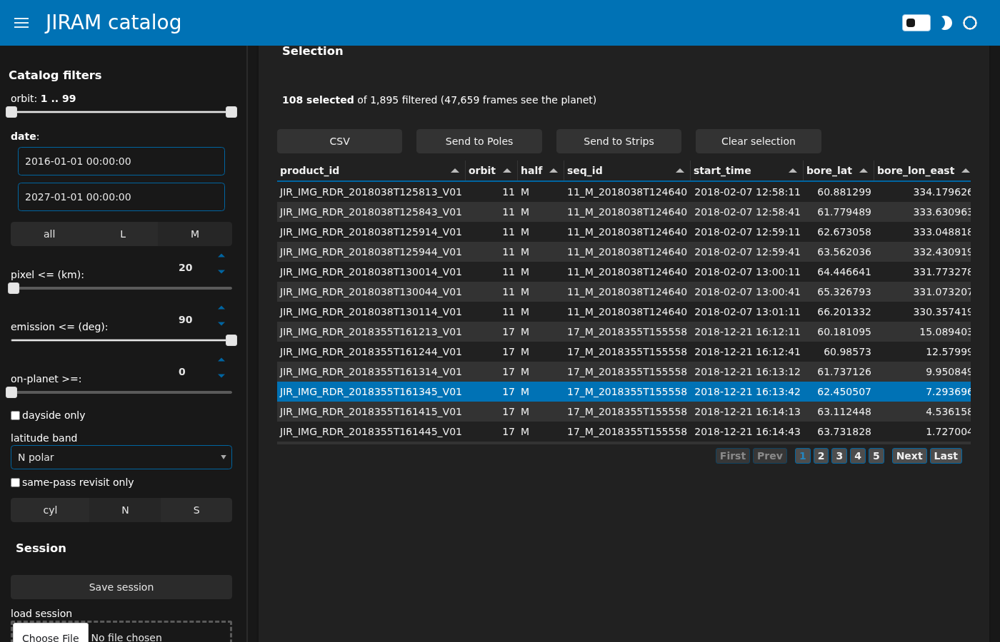
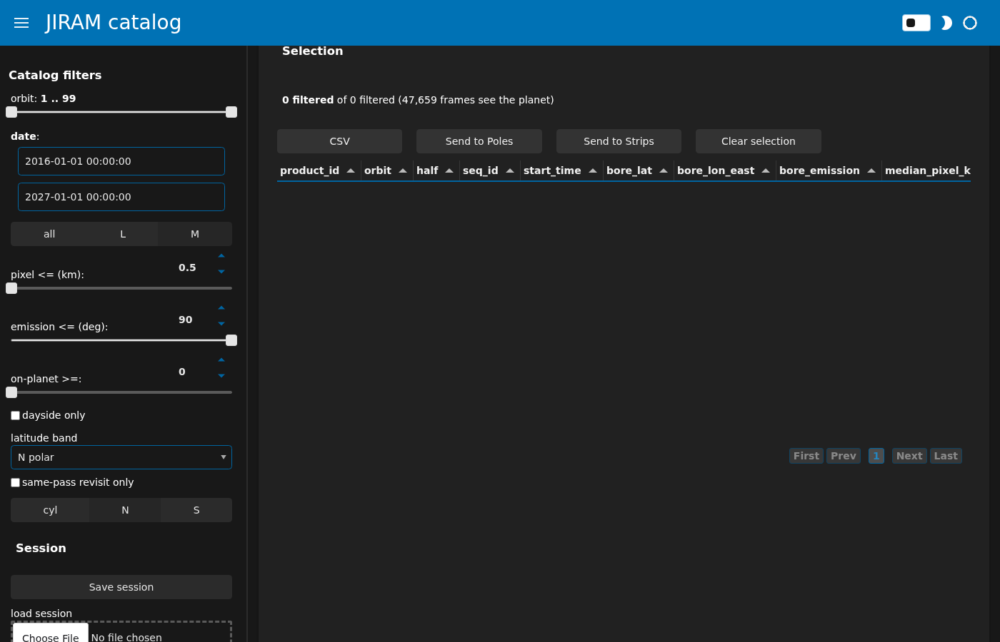
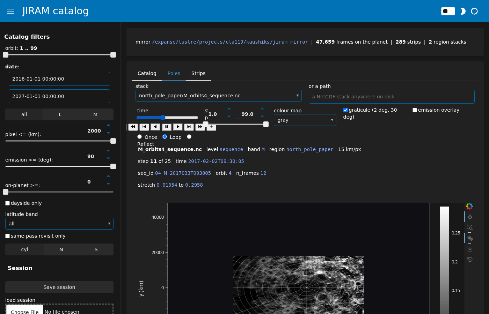
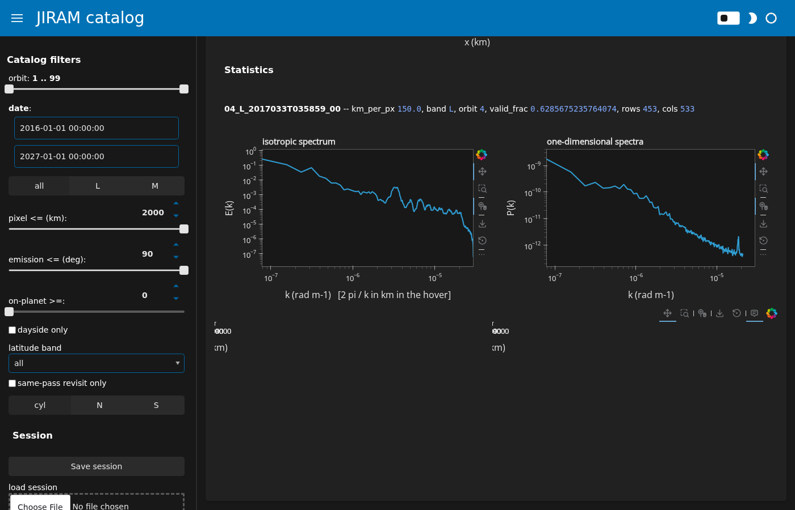

# The catalog browser: a guide

This is a walkthrough of `jiram-catalog gui`, the three-tab Panel
application that browses this repository's products in a web browser.
Every screenshot below is a real capture of the running app (headless
Chromium via Playwright, against the group's shared mirror), not a
mockup; `docs/gui_guide/take_screenshots.py` reproduces them. If you
just want to get the server running and a browser pointed at it, skip
to ["Serving and tunnelling"](#serving-and-tunnelling) -- the rest of
this page assumes it is already open in front of you.

The GUI does not compute anything new: it is a view and a selector over
files the command line already wrote (`docs/usage.md`). Nothing you do
in the browser touches the published archive mirror except the app's
own cache, `<mirror>/gui_cache/`.

## About these screenshots

Two things about how they were taken are worth knowing before reading
them literally. First, the sidebar's filter panel is meant to swap to
match the active tab (`app.py`'s `page()`), but in headless testing it
sometimes kept showing the Catalog tab's filters after switching to
Poles or Strips. This does not block anything -- the Poles and Strips
tabs' own controls (the stack chooser and player, the strip library's
filters) are already inside the tab body, not only in the sidebar --
but a screenshot below may show "Catalog filters" in the sidebar while
the main panel is on a different tab. Second, after several tab
switches or a box-select in the same browser session, the
boresight-coverage map, the coverage panels, and the Poles image
sometimes stopped visibly repainting after a further filter or
time-step change, even though the underlying data kept updating
correctly the whole time (checked independently three ways: the
Selection caption's counts, the selection table's actual rows, and a
direct call to `apply_filters()` in a plain Python session all agreed).
See the [FAQ](#faq) for what to do if you notice this yourself; it did
not stop any of the screenshots below from being real, taken from the
actual running app, deliberately reordered where necessary to
demonstrate the control before triggering the symptom.

## The three tabs

### Catalog

**What it shows.** Every camera frame that sees the planet -- about
47,600 of the archive's 113,000 (frame, band-half) rows, the rest
excluded because `on_planet_frac` is zero or the geometry engine could
not fix the frame at all (`data.py`'s `catalog_table`) -- as boresight
points on a longitude-latitude map, drawn with datashader so filtering
redraws instantly regardless of point count. Below it, three coverage
panels (by latitude band, by orbit, passes in time) track the same
filtered set. Below that, a selection table lists whichever rows are
currently selected (or, with nothing selected, whichever rows pass the
filters), with CSV export and hand-off to the other two tabs.


**Sidebar controls**, one sentence each:

| control | does |
| --- | --- |
| orbit | inclusive range of orbit directories to include (1-99) |
| date | inclusive start-time range |
| band half | `all`, `L`, or `M` -- which detector half's frames to keep |
| pixel <= (km) | drop frames whose median pixel size exceeds this |
| emission <= (deg) | drop frames whose boresight emission angle exceeds this |
| on-planet >= | drop frames whose on-planet pixel fraction is below this |
| dayside only | keep only frames with a nonzero dayside fraction |
| latitude band | restrict to one of the seven trackability-table bands, or `all` |
| same-pass revisit only | keep only frames with a same-pass revisit partner (checkbox is hidden entirely when `index/trackability_frames.parquet` does not exist) |
| view | `cyl` (longitude/latitude), `N`, or `S` (azimuthal-equidistant polar, `rho = 90 - |lat|`) |

All the threshold filters *exclude*, they do not *require*: a frame
whose emission angle the geometry engine could not resolve stays on the
map rather than vanishing the moment a slider moves (`data.py`'s
`apply_filters` docstring).

**Panel controls:**

| control | does |
| --- | --- |
| the map itself | box-select (drag with the box-select tool active) sets the selection to every point inside the box, in whichever view (`cyl`/`N`/`S`) is current |
| hover | below 5,000 filtered rows, individual points appear with product id, start time, pixel size, and emission angle in the hover; above that only the density raster is drawn |
| CSV | downloads the current selection (or filtered set) as `jiram_selection.csv`, columns listed in `views_catalog.py`'s `TABLE_COLUMNS` |
| Send to Poles | sets the Poles tab's stack list to the orbits present in the current selection |
| Send to Strips | sets the Strips tab's latitude-band filter to the most common band in the selection, and its band-half filter too if the selection is single-band |
| Clear selection | empties the selection; the table reverts to showing the filtered set |

**Typical workflow.**
1. Narrow the sidebar filters until the coverage panels show the
   subset you care about.
2. Optionally switch to a polar view for a pole-centred look.
3. Box-select on the map, or leave the selection empty to work with
   everything the filters pass.
4. Read the selection table, or download it as CSV.
5. Send the selection's orbits to Poles, or its latitude band to
   Strips, to carry the context into the next tab.




**What the exports produce and where they land.** The CSV button is a
browser download (`jiram_selection.csv` or `jiram_strips.csv` on the
Strips tab) -- it goes wherever your browser puts downloads, not onto
the mirror. "Send to Poles" and "Send to Strips" only change filter
state in this session; they write nothing.

**What to do when the map looks empty.** The caption above the
selection table reads `0 filtered of 0 filtered` when every row has
been excluded. The two easiest filters to over-tighten are pixel size
and on-planet fraction; the fastest fix is usually to set latitude band
back to `all` or loosen whichever slider you touched last.



### Poles

**What it shows.** A viewer for the region time stacks
`jiram-catalog region-stack` already wrote under `<mirror>/regions/`
(`docs/gui_design.md`'s "First version": Poles is a viewer only in this
build -- it cannot build a stack itself, see `docs/open_items.md`). A
stack is never loaded whole: it is opened lazily and one time step is
read when the player moves; the display stretch comes from a strided
subsample of a few steps, not every pixel of every step
(`data.py`'s `stack_stretch`).


**Sidebar.** Just a note pointing at where stacks live
(`<mirror>/regions/`); every actual control is in the tab body.

**Panel controls:**

| control | does |
| --- | --- |
| stack | choose a stack from `<mirror>/regions/*/*.nc`; the list narrows to whichever orbits a Catalog-tab selection sent over, when any did |
| or a path | type any NetCDF stack's path directly, anywhere on disk |
| time (player) | steps through the stack's time axis; play/pause, step, and loop-policy (once/loop/reflect) controls |
| stretch percentiles | the display's low/high percentile clip |
| colour map | `gray`, `viridis`, `magma`, `inferno`, `cividis`, `bone` |
| graticule | overlays parallels every 2 deg and meridians every 30 deg, computed from the stack's own `lat`/`lon_east` coordinate arrays |
| emission overlay | overlays the stack's per-pixel emission angle (when the stack carries one) at 40% opacity |
| metadata line | stack file, level (`frame`/`sequence`), band, region, km/px, current step and its timestamp, `seq_id`/orbit/`n_frames` where the stack carries them, and the current stretch's numeric limits |

**Actions**, all three running in a background thread with a spinner
and a status line that reports where the result landed:

| action | writes |
| --- | --- |
| Render movie | an MP4 via `movie.write_movie`, to the path in the "movie file" field (default `<mirror>/gui_cache/exports/<stack-stem>.mp4`) |
| Export goflow triples | a constant-cadence dataset via `export_goflow.export_stack`, to the "goflow dataset" directory (default `<mirror>/gui_cache/exports/goflow_<stack-stem>`) |
| Save PNG | a single-frame PNG of the current time step, matplotlib-rendered, to `<mirror>/gui_cache/exports/<stack-stem>_t<step>.png` |

All three destination fields are plain text inputs and can be pointed
anywhere writable.

**Typical workflow.**
1. Pick a stack (or type a path to one).
2. Step through time with the player; adjust the stretch, colour map,
   and overlays as needed.
3. Render a movie, export goflow triples, or save a PNG of the current
   frame.



**What to do when a stack is slow to open.** A frame-level stack (every
contributing frame kept, not composited per sequence) can be 2 GB; a
sequence-level composite of the same orbit is a fraction of that and is
what `_default_stack` in `views_poles.py` picks first for exactly this
reason. On the current mirror, opening the 294-step, 2.25 GB
`M_orbits4_frame.nc` costs under a second and about 280 MB of resident
memory, and each further step reads in about 0.2 s (`docs/gui_usage.md`)
-- so a stack that stays slow past its first open is more likely a busy
shared filesystem than the app; the busy spinner next to the metadata
line is the honest signal to wait for rather than re-clicking.

### Strips

**What it shows.** The per-pass strip library: a filterable table, a
map of strip centres coloured by year, a viewer for the current strip,
and that strip's statistics. Unlike Poles, Strips has no time axis --
each strip is one independent look, reprojected onto its own
tangent-plane grid (`docs/architecture.md`, "The two regimes, side by
side"). On load, the first strip that passes the current filters is
selected automatically, so the tab never opens on an empty viewer.


**Sidebar controls:**

| control | does |
| --- | --- |
| band | `all`, `L`, or `M` |
| latitude band | one of the seven trackability-table bands, or `all`; kept when the strip's own latitude span overlaps the band, not just its centre |
| epoch | date range, kept when the strip's time span overlaps it |
| km/px <= | resolution-class threshold |
| valid fraction >= | threshold on the strip's own valid-pixel fraction |
| dayside fraction >= | threshold on the strip's own dayside fraction |

**Panel controls:**

| control | does |
| --- | --- |
| library table | click a row to make that strip the current one; sortable, paginated |
| centres map | strip centres coloured by year, hover shows id/orbit/band/resolution/latitude span |
| colour map | the strip viewer's colour map |
| the strip image | shown with its graticule and dashed local-time contours (every 2 h); the mask is transparent, not drawn |
| cursor readout | latitude, longitude, local time, emission, and the pixel value under the pointer |
| Export filtered list (CSV) | downloads the currently filtered library rows as `jiram_strips.csv` |

**Statistics panel**, computed for the current strip only: isotropic
spectrum `E(k)`, the one-dimensional spectra along `x` and `y`, and the
second- and third-order structure functions (`S2`, signed `S3`). These
come from `stats2d.strip_statistics` and are cached on first
computation at `<mirror>/gui_cache/stats_<strip_id>.nc` -- the same
Dataset a later population-level run would read (`data.py`'s
`strip_stats`).



**Typical workflow.**
1. Filter the library down to the strips you want.
2. Click a row (or start from the default selection) to open a strip.
3. Read the image, the cursor readout, and the statistics below it.
4. Export the filtered list as CSV if you need it outside the browser.

**What to do when a strip has no statistics yet.** `strip_stats` checks
the on-disk cache first; if a strip has never been opened before, it
computes `strip_statistics` synchronously -- unlike the Poles actions,
this is not backgrounded, so the whole session pauses for a few seconds
the first time a given strip is opened, then is instant on every later
visit to that strip (the same cache file also survives a restart of the
server).

## The two regimes, and how the tabs map to them

This tool treats the polar caps and everywhere else as genuinely
different products (`docs/architecture.md`):

| | polar / repeat-view (regime 1) | everywhere else (regime 2) |
| --- | --- | --- |
| product | region time stack | strip library |
| grid | fixed per region, shared across frames | one per chunk, centred on that chunk |
| time axis | real (multiple visits) | none (one look) |
| GUI tab | **Poles** | **Strips** |
| designed for | velocity retrieval at a cadence | distribution-level statistics across many independent looks |
| ground truth | Ingersoll et al. (2022) PJ4 maps and TRACKER4 vectors | none published; internal consistency only |

**Catalog** sits above both regimes: it is the one place that shows
every frame regardless of which regime (if either) it ends up feeding,
and the "Send to Poles" / "Send to Strips" buttons are the intended
route from a Catalog selection into whichever regime you are working
in.

## Serving and tunnelling

Exact commands, copied from `docs/gui_usage.md` (see that file for the
full explanation of each flag). On a compute node, from an interactive
allocation:

```
cd <repository>
uv run jiram-catalog gui --port 5006 --address 0.0.0.0 --no-browser
```

`--address 0.0.0.0` is needed on a compute node because the login node
has to be able to reach the server over the cluster network when it
forwards your port. Then, from your laptop, in a second terminal:

```
ssh -N -L 5006:<compute-node>:5006 <user>@login.expanse.sdsc.edu
```

where `<compute-node>` is what `hostname` prints on the allocation.
Open `http://localhost:5006` in your browser. The server has no
authentication and the web socket origin check is disabled by default
(needed for the tunnelled `localhost:5006` address to be accepted), so
stop the server (Ctrl-C on the node) when you are done.

## FAQ

**Why does the sidebar sometimes show the wrong tab's filters?** The
sidebar is meant to swap to match whichever tab is active
(`app.py`'s `page()`, bound to `tabs.param.active`). In headless
testing this swap sometimes lagged behind a tab switch. It does not
block any control -- Poles' and Strips' own controls are inside the tab
body already, not only in the sidebar -- so if you see this, it is
cosmetic; nothing is missing, just possibly mislabeled.

**I changed a filter, moved the time slider, or toggled the view, and
the map/image looks unchanged. Is my change lost?** In headless
testing this happened after several tab switches or a box-select in
one session; the underlying value was still correct every time it was
checked directly (the Selection caption and table, and a plain-Python
call to `apply_filters()`, all agreed with what the sidebar showed).
Trust the caption and table over the plot in that case. If it persists,
reloading the page opens a fresh session and clears it.

**Where does anything I export actually go?** Everything the GUI writes
lands under `<mirror>/gui_cache/`: per-strip statistics as
`stats_<strip_id>.nc`, and, by default, movies/PNGs/goflow datasets
under `gui_cache/exports/`. CSV downloads are a browser download, not a
file on the mirror. Nothing else under the mirror is touched, and no
request leaves the node (`docs/gui_usage.md`).

**Can I save and reload a session?** Yes -- the sidebar's "Save
session" button writes the filters, the selection, and the current
stack/strip as a small JSON file (`CatalogState.to_json`); the "load
session" file input below it restores one. A session file is worth
keeping next to a figure it produced: it is the selection the figure
was made from.

**Which interactions could this guide not verify visually?** Clicking a
different row in the Strips library table to change the current strip
could not be driven reliably through headless Chromium for this guide
(the row highlights, but the viewer did not always follow within a
reasonable wait); the default-selected strip shown in the screenshots
above is genuine and its statistics are real, but a screenshot of a
*second*, explicitly clicked strip is not included for that reason.
Everything else described above -- filters, the box-select, the polar
toggle, the time-step player, tab switching -- was driven headlessly
and is described from what `src/jiram_catalog/gui/` actually does.
