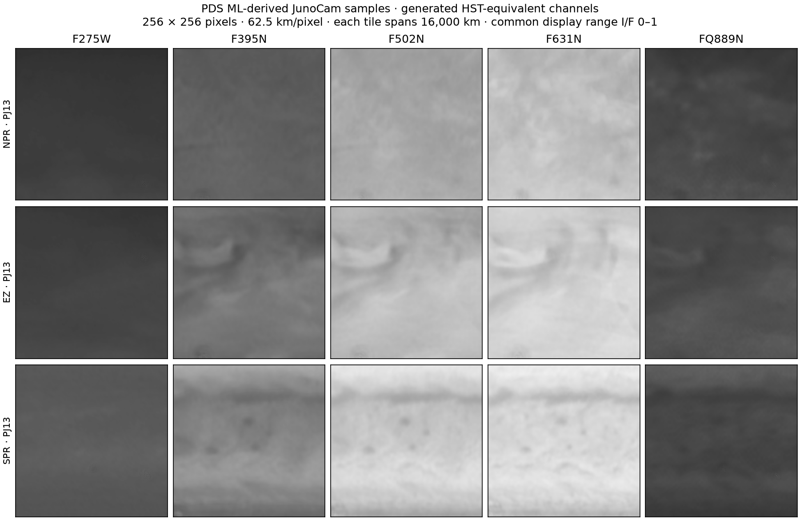

# PDS machine-learning calibrated JunoCam: suitability assessment

**Decision: retain this collection as an explicitly derived reference. Do not
substitute it for native JunoCam observations in motion retrieval, radiance
spectra, or quantitative cross-instrument comparisons.** Its useful role is
exploratory morphology and comparison with Hubble-like appearance. It does
not solve the current native stack's missing regular-cadence observations.

This assessment accompanies the owner's accepted
[D01–D12 implementation](../specs/2026-09-07_review_implementation.md).
The native catalog's failure-exclusion policy also applies to image, strip,
stack, comparison, statistics, movie and export access. Original archived
files are preserved; excluded and unassessed observations remain inspectable
as metadata, with no image-reveal override.

## What was actually inspected

Retrieved over verified HTTPS on 2026-09-07:

- [PDS bundle 1.1](https://pds.nasa.gov/ds-view/pds/viewBundle.jsp?identifier=urn:nasa:pds:junocam_atm-ml-calib&version=1.1),
  collection XML, full calibrated inventory, and
  [user guide](https://pds-atmospheres.nmsu.edu/PDS/data/PDS4/junocam_atm-ml-calib/document/user_guide.pdf).
- The first numbered PJ13 GeoTIFF and label in each of NPR, EZ and SPR:
  [NPR sample](https://pds-atmospheres.nmsu.edu/PDS/data/PDS4/junocam_atm-ml-calib/data_calibrated/PJ13/NPR_PJ_13_jc_000000.xml),
  [EZ sample](https://pds-atmospheres.nmsu.edu/PDS/data/PDS4/junocam_atm-ml-calib/data_calibrated/PJ13/EZ_PJ_13_jc_000000.xml),
  [SPR sample](https://pds-atmospheres.nmsu.edu/PDS/data/PDS4/junocam_atm-ml-calib/data_calibrated/PJ13/SPR_PJ_13_jc_000000.xml).
- [PJ13 mosaic label](https://pds-atmospheres.nmsu.edu/PDS/data/PDS4/junocam_atm-ml-calib/data_mosaics/PJ13/junocam_calibration_PJ13.xml),
  its actual FITS primary/first-extension headers and one equatorial row in
  each of five extensions. HTTP byte ranges avoided downloading the entire
  259,447,680-byte mosaic.

The audit script is [junocam_calibration_review.py](../../scripts/junocam_calibration_review.py).
Sources and small samples are under `<mirror>/junocam/calibration_review/`;
[inspection.json](figures/calibration_2026-09-07/inspection.json) records
hashes, dimensions, values and coordinates. Independent TIFF decoding
(`tifffile 2026.8.23`, installed only in scratch for this audit) exactly
matched arrays read using the PDS4 labels. No native image index was changed.

The figure deliberately uses a common scale. Smooth appearance alone is
not a measurement of lost detail: that would require matched input/output
images and an empirical transfer-function analysis.

## Processing and measured file properties

The guide describes decompanding, timing adjustment, flat-fielding,
map projection, division by a Gaussian-smoothed image, and mosaicking before
machine learning. It uses unpaired JunoCam/Hubble training and LAEA tiles.
Those preprocessing and learned transformations can change spatial variance
and texture. This is the reason to keep its statistics distinct from native
radiance statistics.
[Collection user guide](https://pds-atmospheres.nmsu.edu/PDS/data/PDS4/junocam_atm-ml-calib/document/user_guide.pdf).

The authors' released code identifies the archived method as UNSB: one model
produces Hubble-equivalent RGB and another predicts UV and methane channels.
These are generated values, including channels not measured by the input
RGB exposure. A later structure-preserving research paper must not be
assumed to describe the exact archived checkpoint.
[Authors' model repository](https://github.com/junocamcalibration/JunoCam_calibration_UNSB).

The following numbers are direct results of the bounded file audit:

| Property | Measured result | Consequence |
|---|---|---|
| Inventory | 37,386 tile identifiers across PJ13–36 | Much broader sampling than the local PJ4 native products; these remain overlapping tiles rather than 37,386 independent exposures. |
| Three sampled TIFF arrays | 256 × 256 × 5, little-endian float32 | Channel axis needs a new explicit product schema. |
| GeoTIFF pixel scale | 62,500 m in both axes; ±8,000 km extent | 4.17 times coarser grid spacing than the existing 15 km native polar stack. Grid spacing is not effective resolution. |
| Projection | Jupiter LAEA, planetographic reference; semimajor axis 71,492 km, inverse flattening 15.4144027598103 | Convert latitude convention and use the actual ellipsoid before any overlay; repo grids use planetocentric latitude. |
| Tile times | Start and stop both explicitly nil/inapplicable in all three labels | A tile cannot supply the exact observation time needed for a motion pair. |
| Sample TIFF values | All finite; ranges NPR 0.1862–0.8290, EZ 0.1964–0.8766, SPR 0.2193–0.9358; labels say I/F | Finite predictions do not establish observed coverage or pixel uncertainty. No GDAL no-data tag was present. |
| Actual FITS checkpoint | `junocam_calibration_C25_PJ15`, epoch 50, PJ13, HST cycle 25 | Record this model provenance alongside the physical source provenance. |
| First FITS extension | 3601 × 1801, float64; longitude increment −0.099972229936129°, latitude increment +0.099972229936129° | Approximately 0.1° grid; reverse longitude direction and reconcile coordinates explicitly. |
| Mosaic timing | PJ13 label spans 04:30:44.467–06:40:56.254 UTC on 2018-05-24 | A 130-minute mosaic interval is not a single simultaneous observation. No per-pixel time was established by this audit. |

## Metadata issues that prevent blind import

Actual mosaic labels identify the five filters as F275W, F395N, F502N,
F631N and FQ889N. The guide's prose contains F305N in one place while its
code and the mosaic labels use F395N. The sampled TIFF labels name a
five-element band axis without individual filter names. Resolve its ordering
against the producing code before importing quantitative channels; the
sample figure follows the guide's UV/B/G/R/methane ordering.

The guide's FITS display example divides by 255. **The actual sampled mosaic
rows already contain values below 1**, with positive maxima 0.3765, 0.4784,
0.7856, 0.8693 and 0.4251 across the five filters. Applying that display
division to these values would shrink them again. These rows also contain
many exact zeros, while the PDS label declares −999.9 as invalid. Do not
infer a scientific validity mask from finiteness alone or assume every zero
is a valid reflectance measurement. These are concrete label/example
discrepancies, not evidence of instrument failure in the native input.

## Which projects benefit

| Intended use | Suitability |
|---|---|
| Browse broad cloud morphology; compare visual patterns across passes | Useful supplemental source, with derived-product labels and model provenance. |
| Compare native JunoCam and Hubble filter appearance | Useful hypothesis-generation resource; generated filter values cannot stand in for simultaneous measured Hubble radiometry. |
| Native cloud motion / downstream three-frame velocity retrieval | Poor replacement: tile times are absent, mosaics mix exposure times, grids are coarse, and learned texture is not motion truth. |
| Intensity spectra, slope fits and structure functions | Keep in a separate method-comparison group; flattening, interpolation and generation alter the quantity being measured. |
| Near-pole JIRAM comparison | Not a drop-in source: different latitude convention, wavelengths, spatial sampling and temporal support. The guide's zone sampling is concentrated short of the geographic poles. |
| Repair instrument-damaged observations | Not established. A plausible model-generated image does not recover independently verified radiometry or make damaged input eligible. |

For the current projects, prioritize verified unaffected native JunoCam
observations, correct version identity, per-observation navigation,
physical-band selection and honest cadence/overlap checks. Use the ML bundle
through the Coverage reference link. A future quantitative import would
require input-to-tile source mapping and timing, channel-order verification,
mask/scaling reconciliation, and matched-scene validation of geometry and
spectral changes. This audit neither downloads the bundle in bulk nor
certifies it for those uses.

## Failure policy evidence and judgment calls

The [cumulative PDS errata](https://planetarydata.jpl.nasa.gov/img/data/juno/JNOJNC_0035/ERRATA.TXT)
give image-specific boundaries: PJ47's first two images; PJ48's first 214;
an identified PJ49 corruption example; later noise beginning at PJ73 image
13; content-free data beginning at PJ74 image 8; and wholly content-free
PJ75–80 releases. PJ56 has additional saturation/navigation issues. These
inform explicit exclusions. Broader intervals without affirmative image
evidence remain unassessed. Post-anneal status alone cannot clear an image.

Judgment calls: chose documented image/interval exclusions plus withholding
unassessed data, instead of treating an entire pass as bad whenever any image
failed. Kept measured-clean legacy PJ4 observations viewable under a
versioned policy; that establishes the local viewing sample, not absolute
radiometric or wind accuracy. Classified the calibrated bundle as a derived
reference instead of a replacement observation source. Preferred actual
labels, headers and sampled values when examples disagreed. The limited
sample supports these import/readiness findings, not archive-wide quality
certification or a measured model transfer function.
